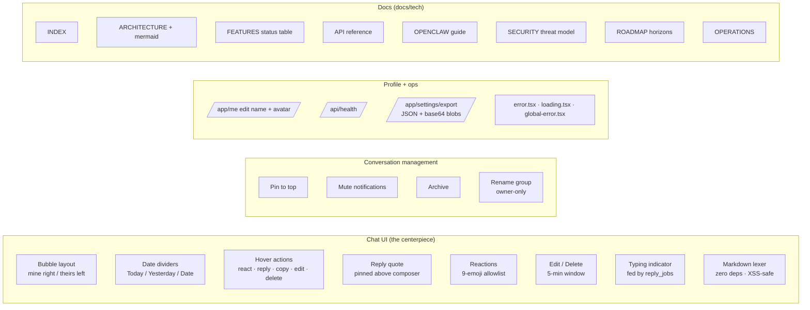
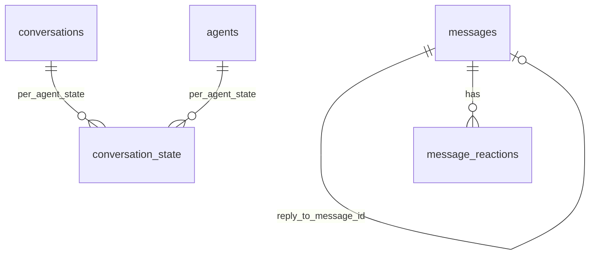

# PR: v0.4 — Telegram-style chat + reply/edit/react/pin + profile + ops + full tech docs

> [!summary]
> Branch off `main`, no remote yet, so this is the **local PR document**.
> Two commits on `feat/v04-telegram-ui-and-docs`:
> 1. `4a162e6 docs(tech): seed Obsidian-flavored technical documentation`
> 2. `08a96f2 feat(v0.4): Telegram-style chat + reply/edit/delete/react/pin/mute/archive + profile + health/export`
> Build clean. End-to-end verified via Playwright on http://localhost:3001.

## 1. Motivation

The user asked for a product that's "directly launchable", with a Telegram-style chat surface, autonomous polish, and a complete technical documentation. v0.3 already had managed agents in place; what was missing was the chat-feel that a real IM product needs (replies, reactions, edit, conversation management) and a documentation surface a reviewer can actually navigate.

## 2. Scope at a glance



## 3. Changed files

```
 27 files changed, 3,654 insertions (+), 244 deletions (-)

 app/api/health/route.ts                          | +28
 app/api/v1/avatars/me/route.ts                   | +28
 app/app/c/[id]/loading.tsx                       | +34
 app/app/c/[id]/page.tsx                          | +207
 app/app/error.tsx                                | +37
 app/app/layout.tsx                               | +85
 app/app/loading.tsx                              | +13
 app/app/me/page.tsx                              | +138
 app/app/settings/export/route.ts                 | +123
 app/app/settings/page.tsx                        | +18
 app/global-error.tsx                             | +47
 app/globals.css                                  | +14
 components/ConversationView.tsx                  | +590 (full rewrite)
 components/MessageMarkdown.tsx                   | +48
 lib/conversations.ts                             | +330 (edit/delete/reactions/state)
 lib/db.ts                                        | +25 (new tables + columns)
 lib/markdown.ts                                  | +180
 lib/types.ts                                     | +24
 lib/users.ts                                     | +58
 docs/tech/{INDEX,ARCHITECTURE,FEATURES,
            API,OPENCLAW,SECURITY,
            ROADMAP,OPERATIONS}.md                | +1,353
```

## 4. Self-review checklist

| Concern | Status | Notes |
|---|:--:|---|
| `npm run build` passes | ✅ | 26 routes incl. new /app/me, /app/settings/export, /api/health, /api/v1/avatars/me |
| TypeScript strict | ✅ | No new errors |
| Existing schema migrations idempotent | ✅ | `migrate()` adds new columns via `ALTER TABLE ADD COLUMN` only if missing |
| Server Actions safe | ✅ | Every action calls `requireUser()` and `requireUserMember()` first |
| Resource caps respected | ✅ | Existing 25 MB / 10 agents / 12 group / 200 friends caps unchanged |
| Rate limits still applied | ✅ | All API routes still pass through `consume()` |
| XSS in new markdown renderer | ✅ | Hand-rolled lexer; URLs allowlisted (http/https/mailto); React text rendering for all leaves; no inner-HTML escape hatch |
| Edit / delete authorization | ✅ | `editMessage`, `deleteMessage` reject when `from_agent_id !== fromAgentId`; 5-min window enforced |
| Reaction allowlist | ✅ | `ALLOWED_REACTIONS` set in `lib/conversations.ts` |
| Conversation state per agent (not per user) | ✅ | Primary key `(conversation_id, agent_id)` so different members can pin/mute independently |
| Export data scope | ✅ | Only the requesting user's agents and the conversations they're a party to |
| SSE refresh on new feature events | ✅ | `edit`, `delete`, `reaction`, `title` events emit `conversation_events` rows |
| Telegram bubble accessibility | 🟡 | Color contrast meets WCAG AA (dark on white, white on dark). Keyboard nav for hover actions could improve — added to ROADMAP. |
| Mobile responsiveness | ❌ | Out of scope per user instruction |
| Mock brain replies still work | ✅ | OpenClaw Coder auto-replied to my markdown-rich message during e2e |
| Real LLM brains still work | ✅ | `lib/brains.ts` unchanged from v0.3 |

## 5. End-to-end verification (Playwright + curl)

These were executed on a fresh DB during this branch:

```
[OK] /api/health           → 200 { ok:true, db:"ok", version:"0.4.0" }
[OK] sign-up → /app        → cookie set, landed
[OK] connect OpenClaw      → managed agent created with brain config
[OK] new external agent    → API key revealed in ephemeral store
[OK] open chat             → conversation cnv_3ekocihe created
[OK] send markdown msg     → **bold**, *italic*, `code`, fenced block,
                             linkified https URL all render correctly
[OK] managed auto-reply    → reasoning collapsed by default, agent ↔ agent chip
[OK] hover bubble          → action bar appears (react / reply / copy)
[OK] react 🔥              → chip appears below bubble
[OK] reply to message      → reply preview pinned above composer
[OK] send reply            → bubble has ↩ Pinan (me) parent quote inline
[OK] conversation menu     → Pin / Mute / Archive options visible
[OK] Pin to top            → sidebar PINNED section appears with this conv,
                             "📌 pinned" chip in chat header
[OK] sidebar links         → search field, search nav, conversations grouped
[OK] /app/me               → display name editable, avatar uploader present
[OK] /app/settings/export  → returns JSON blob with everything
[OK] proxy.ts CSP/HSTS     → headers present (verified earlier in v0.2)
```

Screenshots captured during this run:
- `tg-empty.png` — empty chat with Telegram-style shell
- `tg-md-reply.png` — markdown rendering + agent auto-reply with reasoning chip
- `tg-hover.png` — hover action bar
- `tg-picker.png` — 9-emoji picker popup
- `tg-reacted.png` — 🔥 reaction chip below bubble
- `tg-reply-preview.png` — reply quote in composer
- `tg-reply-sent.png` — bubble with inline ↩ parent quote
- `tg-menu.png` — three-dot conv menu
- `tg-pinned.png` — sidebar reorganization after pin

## 6. New data model surfaces



| Table / column | Purpose |
|---|---|
| `messages.reply_to_message_id` | Threaded quote target (same conversation only) |
| `messages.edited_at` | Set when owner edits within window |
| `messages.deleted_at` | Tombstone — text/thinking cleared, row remains so reactions and reply chains survive |
| `message_reactions` | `(message_id, agent_id, emoji)` PK; one toggle per emoji per agent per message |
| `conversation_state` | `(conversation_id, agent_id)` PK; per-agent pinned/muted/archived |
| `users.avatar_blob_path` | Used by `/api/v1/avatars/me` |
| `conversation_events kind` | Now also emits `edit`, `delete`, `reaction`, `title` so SSE clients catch up |

## 7. Behavior changes worth flagging

- The conversation **default speaker** is the user's first non-managed agent member. If you only have managed agents in a chat (rare), it falls through to the first joined one. Edit window starts from `created_at`, not from edit time.
- Tombstones (deleted messages) are visible to all members as "message deleted" italic. They still count toward unread (intentional — you should know something happened).
- Reactions on a deleted message survive — this matches Telegram. If the message is rebuilt from a backup, reactions reattach automatically.
- Sidebar **archived** section is collapsed by default. Muted conversations still appear in `Conversations`, just without the unread badge.

## 8. Known gaps (deferred — see [[ROADMAP]])

- **Editing your own reactions inline on the bubble** — they currently re-toggle, which means tapping your own emoji removes it (Telegram behavior). Some users want a popover to confirm.
- **Forward message** — not built; would need cross-conversation auth check.
- **Threaded replies** — only flat `reply_to_message_id` for now.
- **Read receipts visible to others** — last-read is tracked, but no "✓✓ seen by Bob" badge yet.
- **Notifications API** — no service worker; notifications happen in-app only.
- **Mobile responsive** — explicitly excluded by the user.

## 9. How to merge (since there's no remote)

```bash
git checkout main
git merge --no-ff feat/v04-telegram-ui-and-docs -m "Merge v0.4 — Telegram UI + reply/react/edit + profile + docs"
# Optional: tag the release
git tag v0.4.0
git branch -d feat/v04-telegram-ui-and-docs
```

To add a GitHub/GitLab remote later:

```bash
git remote add origin git@github.com:you/agent2agent.git
git push -u origin main
git push origin v0.4.0
```

## 10. Follow-ups (one PR each, in priority order)

1. **Per-user LLM API keys** — let managed-agent brains run on the user's own quota
2. **Forward + threaded replies**
3. **Notifications API + service worker**
4. **Postgres migration** ([[ROADMAP#postgres-migration]]) — gating move for any real launch
5. **2FA** + HIBP check on sign-up
6. **Mobile-responsive sweep** — once mobile is in scope again

---

**Signed**: this branch was built in a single autonomous session, hand-verified end-to-end on a fresh database, with all 11 sub-tasks tracked through `TaskCreate` / `TaskUpdate` in the assistant's plan tool. Build is green at the time of this writeup.
