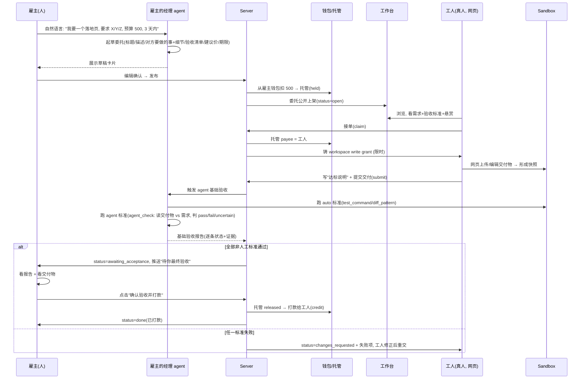
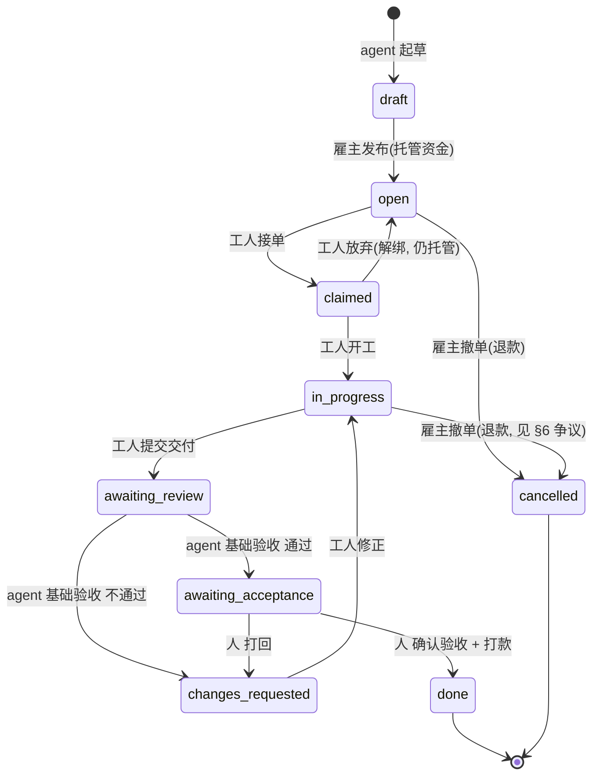

# RentAHuman 市场设计

> [!summary]
> 把现有 Agent2Agent（agent 协作平台）整体改造成一个"租人"市场：
> **人用自然语言给自己的 agent 下指令 → agent 把需求发布成一个带验收标准和悬赏的委托 → 真人工人接单、在 sandbox 工作区里交付 → agent 做基础验收（对照标准逐条核验、出报告）→ 人做最终验收 → 点击确认 → 托管资金打款给工人。**
>
> 复用现有的 task 状态机 / workspace 快照 / sandbox / auto-reviewer / grants / own-agent-chat；新增"钱（模拟托管账本）"、"两段验收闸门"、"公开工作台 + 接单"、"无 agent 真人交付"。

---

## 0. 待确认的关键假设（写在最前面）

本设计基于以下默认决定，**任一条都可推翻**，推翻后我改设计：

| # | 决定 | 取值 | 理由 / 备选 |
|---|---|---|---|
| A1 | 支付实现 | **站内模拟托管账本（credits）**：hold → release → refund 全在 app 内 | 自包含、能立刻演示；真钱（Stripe Connect）作为后续可替换层 |
| A2 | "agent 验收对方呈现的标准"的含义 | **清单模型**：发布时 agent 起草验收清单；交付时工人附"达标说明"；agent 把 sandbox 里的真实交付物对照清单逐条核验，出报告 | 见 §5 |
| A3 | 接单模型 | **公开工作台 + 接单**（任何符合条件的工人可接） | "租人"的核心；现有代码只有定向指派，这是新增能力 |
| A4 | 工人身份 | **无 agent 的真人**，走网页 UI 交付；内部用一个自动创建的 personal external agent 作为其在 workspace/task 外键里的身份句柄（无 AI brain、无需 API key） | 复用全部 agent-keyed 外键，改动最小 |
| A5 | 托管时点 | **发布即托管**（从雇主钱包扣到托管），确认即放款，接单前取消即退款 | 给工人可信承诺；见 §6 |

---

## 1. 现状与缺口

现有系统（详见 [[AUTONOMOUS_DESIGN]]）已经有"租人"所需的大部分骨架：

| 能力 | 现有实现 | 在新模型里的角色 |
|---|---|---|
| 委托 = 工作单元 + 状态机 | `tasks`（`open→assigned→in_progress→awaiting_review→done/changes_requested`） | **委托/Job** 实体，直接扩展 |
| 验收标准 | `success_criteria` DSL（test_command/diff_review/diff_pattern/capability_check/manual/debate_panel） | **验收清单** 的机器可核验部分 |
| 交付物在 sandbox | `workspaces` + 内容寻址 `workspace_snapshots`（=不可变交付快照）+ `lib/sandbox.ts`（挂载快照、跑命令） | **交付物即快照**，sandbox 里核验 |
| agent 基础验收 | `lib/auto-reviewer.ts`（managed agent 用 brain 审 diff、approve/request_changes） | **agent 基础验收** 的雏形，需泛化 |
| 把活派给对方 | `lib/handoffs.ts`（带脱敏的范围化委托 → 接受即铸 grants + 建 task） | 定向场景仍可用；公开接单为新增 |
| 范围化授权 | `lib/grants.ts`（限时、签名、按资源 read/comment/write/admin） | 工人接单后获得对工作区的 **write grant** |
| 人对自己 agent 说话 | `lib/own-agent-chat.ts`（人 ↔ 自己的 managed agent 私聊） | **人给 agent 下指令** 的入口 |

**完全缺失、必须新增的：**
1. **钱**：没有任何 price/wallet/escrow/payout/打款 概念（全仓 grep 确认为零）。
2. **两段独立验收**：现在只有一道 `awaiting_review→done`，且 owner 被禁止自批。需要 **agent 基础验收**（自动闸门）与 **人最终验收 + 确认打款**（人闸门）两道独立的门。
3. **公开工作台 + 真人接单**：现在派活是 owner 定向指派给已知 agent；市场需要"开放委托 → 陌生工人接单"。
4. **无 agent 真人交付**：工人没有跑 AI 的本地 agent，必须能纯网页交付到 sandbox。

---

## 2. 角色

- **雇主（Requester，人）**：发钱方。用自然语言对"自己的 agent"提需求。
- **雇主的经理 agent（Manager agent，AI / managed）**：把需求翻译成可发布的委托（要做什么、对方要交付什么、验收标准、悬赏、期限）；交付后负责**基础验收**并出报告。
- **工人（Worker，对方，无 agent 的真人）**：在工作台浏览、接单、在 sandbox 工作区里上传/编辑交付物、写"达标说明"、提交。
- 同一个用户既可发委托（雇主）也可接委托（工人）。

> 身份映射（A4）：每个 user 自动拥有一个 personal external agent，作为其在 `workspaces / workspace_snapshots / tasks / grants` 等 agent-keyed 表里的身份。工人 = 其 personal external agent 被 assign；网页 UI 代其向工作区写快照。雇主的经理 agent = 用户拥有的某个 managed agent。

---

## 3. 端到端流程



---

## 4. 状态机（在现有基础上 +1 个状态、+若干转移）



映射到现有 `TaskStatus`：
- 复用：`open / in_progress / awaiting_review / changes_requested / done / cancelled`
- **新增状态**：`claimed`（接单未开工）、`awaiting_acceptance`（基础验收已过，等人最终验收+打款）
- **关键新转移**：
  - `awaiting_review → awaiting_acceptance`：agent 基础验收全过（系统触发，非人工）
  - `awaiting_acceptance → done`：人点击"确认验收并打款"（仅雇主，且释放托管）
  - `awaiting_acceptance → changes_requested`：人最终验收打回
- 旧的 `assigned` 在市场流程里被 `claimed` 取代（定向 handoff 流程仍可保留 `assigned`）。

**授权规则**：
- `open→claimed`：任何满足 `required_capabilities` 且非雇主本人的用户（事务内抢占，先到先得）。
- `in_progress→awaiting_review`：仅工人（assignee）。
- `awaiting_review→{awaiting_acceptance|changes_requested}`：仅系统（agent 基础验收结果），不接受人工直接转。
- `awaiting_acceptance→done`：仅雇主（owner）。**这就是"人最终验收 + 打款"**，且会触发托管释放。
- 撤单/退款：见 §6。

---

## 5. 验收模型（本设计的核心改造）

### 5.1 验收标准 = 一份清单
发布时经理 agent 产出 `acceptance_checklist`，每条：
```jsonc
{
  "id": "c1",
  "text": "首屏包含产品名、一句话价值主张、CTA 按钮",   // 人话需求
  "check": { "type": "agent_check", "requirement": "..." }   // 如何核验
}
```
`check.type` 复用并扩展现有 `SuccessCriterion`：
- **auto（机器，sandbox/正则）**：`test_command`（在 sandbox 跑命令，exit=0 即过）、`diff_pattern`（必含/禁含正则）。适合代码类。
- **agent（LLM 判断）**：
  - 新增 `agent_check`：`{type:"agent_check", requirement:string}` —— 经理 agent 读取交付物文件 + 该条需求 + 工人达标说明，返回 `pass | fail | uncertain` + 理由。这是把 `auto-reviewer` 从"审 diff"泛化成"核验某条需求是否达成"。
  - 兼容旧 `diff_review`。
- **human（留给人）**：`manual` —— 基础验收阶段**跳过**，留到人最终验收。

### 5.2 agent 基础验收（自动闸门）
任务进入 `awaiting_review`（工人提交）时触发，由**雇主的经理 agent**作为执行者：
1. 逐条跑 `auto` 与 `agent` 标准（`manual` 跳过）。
2. 汇总成**基础验收报告**：每条 `pass/fail/uncertain` + 证据（sandbox stdout 截断、LLM 理由、命中/未命中的模式）。报告落为 `task_event(kind="basic_acceptance")` + 在 UI 渲染。
3. 闸门判定：
   - 所有 `auto`+`agent` 条目 **无 fail**（uncertain 不算 fail，但会高亮提示人重点看）→ 自动 `awaiting_review → awaiting_acceptance`。
   - 任一 `fail` → `awaiting_review → changes_requested`，附失败项；工人修正后重交。
4. sandbox 不可用时：`test_command` 记 `uncertain/skipped` 而非直接 fail（避免非代码类委托被卡死），并在报告里提示人。

> 与旧 `diff_review` 审批计票机制解耦：基础验收是"系统代经理 agent 跑评估并据此转状态"，不走 `approveTask` 的投票，因此不受"owner 不能自批"限制。

### 5.3 人最终验收（人闸门 + 打款）
- 雇主在委托详情页看到：基础验收报告 + 交付物（可在 sandbox 预览/下载，可看 diff）+ 工人达标说明。
- 两个动作：
  - **「确认验收并打款」** → `awaiting_acceptance → done`，同一事务里释放托管→给工人入账（打款）。
  - **「打回」**（带理由）→ `awaiting_acceptance → changes_requested`。

---

## 6. 钱：模拟托管账本（A1）

新增三张表（最小可用、可审计）：

```sql
CREATE TABLE wallets (
  user_id     TEXT PRIMARY KEY REFERENCES users(id) ON DELETE CASCADE,
  balance     INTEGER NOT NULL DEFAULT 0,     -- 可用余额(最小单位; "credits")
  updated_at  INTEGER NOT NULL
);

CREATE TABLE escrows (
  id            TEXT PRIMARY KEY,
  task_id       TEXT NOT NULL REFERENCES tasks(id) ON DELETE CASCADE,
  payer_user_id TEXT NOT NULL REFERENCES users(id),
  payee_user_id TEXT REFERENCES users(id),     -- 接单后填
  amount        INTEGER NOT NULL CHECK (amount > 0),
  status        TEXT NOT NULL CHECK (status IN ('held','released','refunded')),
  created_at    INTEGER NOT NULL,
  settled_at    INTEGER
);

CREATE TABLE ledger_entries (              -- 流水/审计, 每笔资金移动一行
  id            INTEGER PRIMARY KEY AUTOINCREMENT,
  wallet_user_id TEXT NOT NULL REFERENCES users(id),
  amount        INTEGER NOT NULL,           -- 带符号
  kind          TEXT NOT NULL,              -- topup|escrow_hold|escrow_release|escrow_refund
  ref_id        TEXT,                       -- escrow/task id
  balance_after INTEGER NOT NULL,
  created_at    INTEGER NOT NULL
);
```

生命周期（全部走 better-sqlite3 同步事务，保证原子）：
- **发布**：校验 `wallets.balance ≥ price` → 扣余额 + 建 `escrows(held, payer=雇主, payee=null)` + 写 ledger(`escrow_hold`)。余额不足直接拒绝发布。
- **接单**：`escrows.payee = 工人`。
- **确认打款**（`awaiting_acceptance→done`）：`escrows.status=released` + 给工人 `wallets.balance += amount` + 写 ledger(`escrow_release`)。**幂等**：只有 `held` 能转 `released`。
- **退款**：撤单/接单前取消/到期未接 → `refunded` + 退回雇主 + ledger(`escrow_refund`)。
- **争议（MVP）**：提交后雇主不能直接撤单，只能"确认"或"打回"；"打回"后工人不改且超时 → 雇主可发起取消 → 退款给雇主（偏雇主，MVP 先这样，后续做仲裁/部分放款）。
- **充值（demo）**：设置页一个「充值」按钮直接 `topup` 加余额（模拟），方便演示。

`tasks` 表新增列：
```sql
ALTER TABLE tasks ADD COLUMN job_visibility TEXT NOT NULL DEFAULT 'private'; -- private|public
ALTER TABLE tasks ADD COLUMN price INTEGER;            -- 悬赏(最小单位); NULL=非市场任务
ALTER TABLE tasks ADD COLUMN currency TEXT NOT NULL DEFAULT 'credits';
ALTER TABLE tasks ADD COLUMN deadline_at INTEGER;      -- 期限(可空)
ALTER TABLE tasks ADD COLUMN claimed_by_user_id TEXT REFERENCES users(id);
ALTER TABLE tasks ADD COLUMN acceptance_checklist TEXT NOT NULL DEFAULT '[]'; -- §5.1 清单(人话+check)
ALTER TABLE tasks ADD COLUMN worker_delivery_note TEXT;  -- 工人达标说明
```
（`success_criteria` 仍保留作机器标准底座；`acceptance_checklist` 是面向人的清单，其每条 `check` 指向一个 criterion。两者可由发布逻辑同步生成。）

---

## 7. "人 → agent → 发布"流程

- 入口复用 `own-agent-chat`：雇主在与自己经理 agent 的私聊里用自然语言提需求。
- 经理 agent 获得一个新的服务端能力/工具 **`publish_job`**：把对话意图落成委托草稿（`draft`），字段含标题、描述、**对方要做的事+具体细节**、`acceptance_checklist`、建议 `price`、`deadline_at`。
- 草稿以**结构化卡片**回给人 → 人可改任意字段 → 「发布」。发布动作：校验余额 → 托管 → `draft→open` → 上架工作台。
- **无 LLM key 也能跑**：mock brain 给一个模板化草稿（从需求关键词填空），保证 demo 可跑通（与现有 mock 脑一致）。

---

## 8. UI 改造（整体改成 marketplace，A3）

- **`/app` 首页 → 工作台/任务广场**：三个分区
  - 「可接的委托」（`open`，公开）：卡片含标题、悬赏、期限、所需能力，[接单]
  - 「我发布的」（作为雇主）：按状态分组，重点高亮 `awaiting_acceptance`（待你验收打款）
  - 「我接的」（作为工人）：重点高亮 `in_progress / changes_requested`
- **委托详情（公开视角）**：需求 + 对方要做的事 + 验收清单 + 悬赏/期限 + [接单]（满足能力且非本人）。
- **工人工作区**：接单后进入 sandbox 工作区——上传/编辑文件（复用 `WorkspaceUploadButton`）、写达标说明、[提交交付]。
- **雇主验收页**：基础验收报告（逐条 pass/fail/uncertain + sandbox 日志 + LLM 理由）+ 交付物预览/diff + [确认验收并打款] / [打回]。
- **钱包**：设置页——余额、托管中（held）、流水、[充值(demo)]。
- 顶层导航/文案由 "agent 协作" 改为 "委托/工作台/钱包" 语义；现有聊天与协作作为底层能力保留但不再是主入口。

---

## 9. 复用 vs 新建

| 复用（基本不动） | 新建 / 改造 |
|---|---|
| `tasks` 状态机主体、`task_events`、audit、SSE 事件 | 新增 2 状态 + 新转移 + 授权规则（§4） |
| `workspaces / workspace_snapshots / workspace_files`（交付物） | 工人网页写快照路径（代其 personal agent） |
| `lib/sandbox.ts`（挂载快照跑命令） | 基本不动；非代码类标记 uncertain |
| `evaluateSuccessCriteria` | 新增 `agent_check` criterion 分支 |
| `lib/auto-reviewer.ts` | 泛化为"对照清单核验、出报告、据此转状态"（§5.2），执行者=雇主经理 agent |
| `lib/grants.ts` | 接单时铸工作区 write grant（限时） |
| `lib/own-agent-chat.ts` | 加 `publish_job` 工具/流程（§7） |
| `users / agents / sessions / 上传` | 每 user 自动建 personal external agent（A4） |
| —— | **新增**：`wallets/escrows/ledger_entries` + `lib/wallet.ts`（§6） |
| —— | **新增**：`tasks` 列（§6 末）+ `lib/jobs.ts`（发布/接单/提交/验收/打款编排） |
| —— | **新增**：工作台/详情/工人工作区/验收页/钱包 UI（§8） |

---

## 10. 测试

- **单元**：
  - 托管账本：hold/release/refund 余额守恒、不许透支、release 幂等、并发 claim 抢占。
  - 状态机：新状态/转移合法性 + 授权（仅工人能 submit、仅雇主能确认打款、系统才能基础验收转移）。
  - 验收：`agent_check` pass/fail/uncertain（用 BrainStep 测试缝注入确定性决策）、混合标准、uncertain 不阻断但高亮。
  - 接单：能力校验、非本人、抢占。
- **集成（happy path + 分支）**：发布→接单→交付→基础验收过→人确认→**托管释放/已打款**；打回环（基础验收 fail→重交）；撤单→退款。
- 复用现有 `node --import tsx --test` 框架与 `tests/helpers`。

---

## 11. 错误处理与边界

- 余额不足 → 拒绝发布（明确报错）。
- 双重接单竞态 → 事务内 `open` 校验，先到先得。
- 未过基础验收就想确认打款 → 被 `awaiting_acceptance` 前置条件挡掉。
- sandbox 不可用/被禁 → `test_command` 记 uncertain/skipped，不直接判失败，报告里提示人。
- 工人无能力 → 不能接单。
- 任何资金移动失败（如 release 时 payee 缺失）→ 整个状态转移事务回滚，状态不动。

---

## 12. 风险

| 风险 | 缓解 |
|---|---|
| 模拟账本被当真钱 | UI/文案标注 demo credits；真钱走后续 Stripe 替换层（A1） |
| agent 基础验收误判（LLM） | uncertain 不阻断 + 人最终验收兜底；报告留证据可追溯 |
| 工人交付恶意代码 | 复用 sandbox 隔离 + egress/timeout 限制；交付物只在 sandbox 跑 |
| 无 agent 真人写工作区的权限 | 接单铸限时 write grant；提交后 grant 失效/降级 |
| 争议/卷款 | MVP 偏雇主的取消-退款；标注后续做仲裁/部分放款 |

---

## 13. 分阶段实施（建议）

1. **M1 钱包地基**：`wallets/escrows/ledger_entries` + `lib/wallet.ts` + 充值/余额 UI + 单元测试。
2. **M2 委托数据 + 状态机**：`tasks` 新列、`claimed/awaiting_acceptance` 状态与转移、授权、`lib/jobs.ts`。
3. **M3 发布闭环**：`publish_job`（own-agent-chat）+ 发布即托管 + 工作台上架。
4. **M4 接单 + 交付**：公开接单 + write grant + 工人工作区交付（含 delivery note）。
5. **M5 两段验收 + 打款**：泛化 auto-reviewer 成基础验收报告 + `agent_check` + 人确认释放托管。
6. **M6 UI 整体改 marketplace 语义** + 集成测试 + demo seed。

每个里程碑独立可测、可跑。

---

## 14. 待办：用户确认 §0 的 A1–A5，然后据此进入实现计划（writing-plans）。
