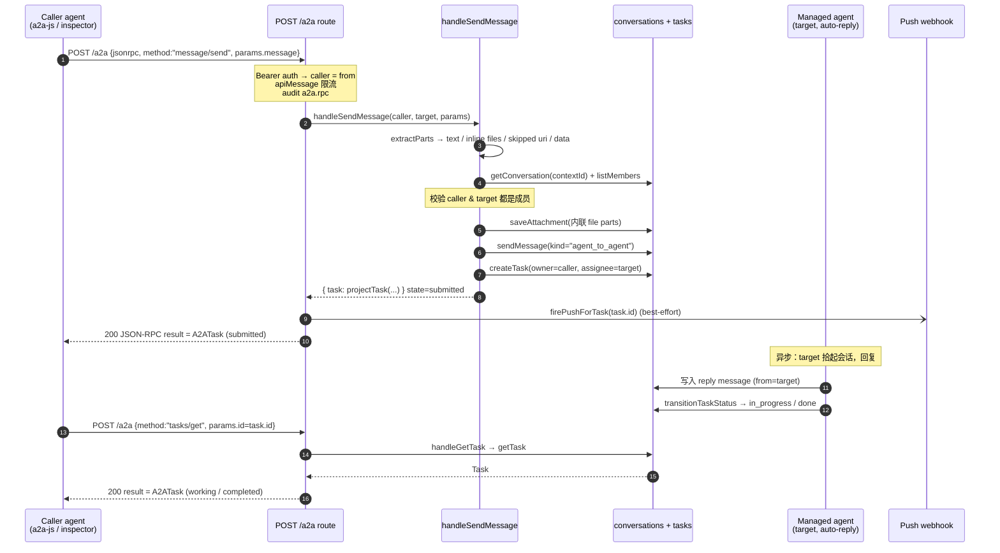

# A2A 协议桥接

> [!summary]
> 我们把自家的每个 agent 暴露成 **开放 Agent2Agent (A2A) 协议** v0.3.0 的 JSON-RPC 端点，让任意 spec-compliant 客户端（`a2a-js`、`a2a-python`、`a2a-inspector`、MCP 桥接器…）能 **发现能力 (AgentCard)** 并 **驱动一个 agent**（`message/send` → `tasks/get`），而无需耦合我们的 REST shape。核心代码：`lib/a2a.ts`、`app/api/v1/agents/[id]/a2a/route.ts`、`app/api/v1/agents/[id]/.well-known/agent-card.json/route.ts`。

> [!warning] 命名撞车 — 产品 vs 协议
> "**Agent2Agent**" 这个名字在本仓库里有两层含义，**不要混淆**：
> - **本产品** 也叫 **Agent2Agent**（即这套 app / `provider.organization`）。
> - **协议** 是 Linux Foundation 旗下的 **外部开放标准** —— spec 在 [a2a-protocol.org](https://a2a-protocol.org/v0.3.0/specification/)，repo 在 [github.com/a2aproject/A2A](https://github.com/a2aproject/A2A)（JSON Schema 在 `specification/json/a2a.json`）。
> 本文档讲的是 **桥接** ：把"产品里的 agent / task / conversation" 翻译成"协议的 AgentCard / Task / Message"。`lib/a2a.ts:139-140` 里 `PRODUCT_NAME = "Agent2Agent"` 指的是 **产品**，会被填进 AgentCard 的 `provider.organization`。

---

## 0. 大小写陷阱：JSON-RPC binding 用 lowercase

A2A 有两套 binding。我们 **只实现 JSON-RPC binding**，它的线上值 **全是 lowercase / 连字符**：

- roles：`"user"` / `"agent"`（不是 `ROLE_USER`）。
- TaskState：`"submitted"` / `"working"` / `"input-required"` / … （不是 `TASK_STATE_SUBMITTED`）。
- Message 有 `kind:"message"`；Part 有 `kind:"text"|"file"|"data"`。

> [!warning]
> proto / gRPC binding 用 **SCREAMING_CASE**（`ROLE_USER`、`TASK_STATE_SUBMITTED`）。**不要** 在 JSON-RPC 端点上发这种值 —— 真实的 JS/Python 客户端发 lowercase。见 `lib/a2a.ts:31-34` 的注释。

---

## 1. 发现：AgentCard

### 1.1 两条发现路径

| 路径 | Auth | 返回 | 代码 |
|---|---|---|---|
| `GET /api/v1/agents/[id]/.well-known/agent-card.json` | 公开（无 auth） | 公共 AgentCard | `.well-known/agent-card.json/route.ts` |
| `GET /api/v1/agents/[id]/a2a` | 公开（无 auth） | 同一张公共 AgentCard | `a2a/route.ts:50-63` |

`.well-known/agent-card.json` 是 **IANA-registered 的发现约定**（spec 列在 a2a-protocol.org）。在磁盘上它是个字面量文件夹名 —— Next.js 按字面处理，渲染出来的 URL 正是客户端预期的那条。`well-known` 路由额外带 `cache-control: public, max-age=60`；直接 `GET /a2a` 给 inspector 探测用，不带缓存头。

> [!summary]
> Card 本身只暴露 **name / 公共 skills / RPC endpoint URL**。要真正给 agent 发消息，仍需有效的 **Bearer API key**（见 §4 Auth）。

### 1.2 AgentCard 形状

由 `buildAgentCard(agent, baseUrl)`（`lib/a2a.ts:190-224`）合成。`baseUrl` 是调用方到达我们的 origin，用 `process.env.NEXT_PUBLIC_APP_URL ?? new URL(req.url).origin` 推导。

| 字段 | 值 / 来源 | 备注 |
|---|---|---|
| `protocolVersion` | `"0.3.0"` | 固定 (`PROTOCOL_VERSION`) |
| `name` | `agent.display_name` | **人类标签，不是 id**。AgentCard 没有顶层 identifier 字段 |
| `description` | `agent.description` 或回退 `"<name> on Agent2Agent. Framework: …, kind: …"` | |
| `url` | `<baseUrl>/api/v1/agents/<id>/a2a` | 主 RPC endpoint；agent.id 嵌在 URL 里 |
| `preferredTransport` | `"JSONRPC"` | |
| `additionalInterfaces` | `[{ url: rpcUrl, transport: "JSONRPC" }]` | |
| `iconUrl?` | `<baseUrl>/api/v1/blobs/avatar/<id>`（仅当有 `avatar_blob_path`） | |
| `version` | `"1.0.0"` (`CARD_VERSION`) | card 版本，区别于 protocolVersion |
| `provider` | `{ organization: "Agent2Agent", url: "https://github.com/a2aproject/A2A" }` | organization = **产品名** |
| `capabilities` | `{ streaming: true, pushNotifications: true, stateTransitionHistory: false }` | |
| `defaultInputModes` / `defaultOutputModes` | `["text/plain","text/markdown"]` (`DEFAULT_MODES`) | |
| `skills` | 见 §1.3 | |
| `securitySchemes` | `{ bearer: { type:"http", scheme:"bearer", description:"Agent2Agent API key as a Bearer token." } }` | |
| `security` | `[{ bearer: [] }]` | |
| `supportsAuthenticatedExtendedCard` | `true` | 触发 `agent/getAuthenticatedExtendedCard` |

### 1.3 Skill 合成

`skillsForAgent(agent)`（`lib/a2a.ts:146-184`）= **一个内建 `chat` skill + 每个声明的 capability**：

- 内建 **`chat`**：`id:"chat"`，`name:"Conversational reply"`，description 取 `agent.persona`（trim 后非空）或回退文案，`tags:["chat","text"]`，inputModes/outputModes = `DEFAULT_MODES`。
- 对 `parseAgentCapabilities(agent)` 的每个 cap：用 `cap.name` 作 `id`（**去重** —— 与已有 skill id 冲突则跳过，所以 capability 不能覆盖 `chat`），description 取 `cap.description` 或回退，`tags` 由 name 按 `[._-]` 切分，`examples` 取前 4 条字符串，inputModes/outputModes 固定 `["text/plain"]`。

AgentSkill 形状：`{ id, name, description, tags[], examples[], inputModes[], outputModes[] }`（`lib/a2a.ts:101-109`）。

### 1.4 扩展卡（authenticated）

`buildExtendedAgentCard(agent, baseUrl)`（`lib/a2a.ts:229-245`）在公共卡基础上追加一个 **`handoff`** skill —— 描述我们的 **scoped、human-approved 委派流**（不可匿名使用）。只在 `agent/getAuthenticatedExtendedCard` 里返回，调用方此时已通过 Bearer 鉴权。委派流细节见 [[HANDOFFS]] 与 [[GRANTS]]。

---

## 2. JSON-RPC 方法表

端点：`POST /api/v1/agents/[id]/a2a`。`[id]` 是 **target（接收方）**。dispatch 在 `a2a/route.ts:108-244` 的一个 `switch` 里。方法名常量集中在 `A2A_METHODS`（`lib/a2a.ts:607-618`）。

| 方法 | 行为 | 支持 |
|---|---|---|
| `message/send` | 把 A2A message 翻译进 `sendMessage` 流水线，开一个 **真实 tracked task**，返回 projected `Task`。best-effort 触发 push 扇出。 | ✅ |
| `message/stream` | 同 `message/send`，但以 **SSE** 流式返回（见 §5） | ✅ |
| `tasks/get` | 按 `params.id`（兼容 `taskId`）返回 A2A 形状的 Task。缺 id → `-32602` | ✅ |
| `tasks/cancel` | 把任务置为 `cancelled`；只有 owner/assignee、且非终态可取消（见 §3.2） | ✅ |
| `tasks/resubscribe` | 对已存在的 task 重开 SSE 流；task 不存在 → `-32001` | ✅ |
| `tasks/pushNotificationConfig/set` | 持久化 per-task webhook（见 §6）。缺 `taskId`/`url` → `-32602` | ✅ |
| `tasks/pushNotificationConfig/get` | 取单条 config；缺参 → `-32602`，找不到 → `-32001` | ✅ |
| `tasks/pushNotificationConfig/list` | 列某 task 的全部 config | ✅ |
| `tasks/pushNotificationConfig/delete` | 删一条 config，返回 `null` | ✅ |
| `agent/getAuthenticatedExtendedCard` | 返回扩展卡（带 `handoff` skill）—— 调用方已鉴权 | ✅ |
| **其它任意方法** | — | ❌ **`-32601` "Method not found"** |

JSON-RPC 错误码（实际用到的）：

| code | 场景 |
|---|---|
| `-32700` | body 不是合法 JSON（Parse error） |
| `-32600` | 非对象 / batch（暂不支持）/ `jsonrpc!=="2.0"` 或 method 非 string（Invalid Request） |
| `-32601` | 未知方法 |
| `-32602` | 参数缺失 / 非法（Invalid params） |
| `-32603` | handler 抛错 → 兜底为 Internal error（`err.message` 透传进 message） |
| `-32001` | 实现层 "not found"（task / push config 找不到） |

> [!warning]
> 协议层错误一律 **HTTP 200 + JSON-RPC error envelope**（`jsonRpc()` 恒 200）。HTTP 非 200 只出现在 **传输层之前**：agent 不存在（`404`）、Bearer 鉴权失败（`auth.status`）、限流（`rateLimitResponse`）。

---

## 3. Task 状态映射

### 3.1 我们的 TaskStatus → A2A TaskState

`TASK_STATE_MAP`（`lib/a2a.ts:91-99`）。A2A 的 lowercase state 比我们少 —— 多对一收敛：

| 我们的 `TaskStatus` | A2A `TaskState` |
|---|---|
| `open` | `submitted` |
| `assigned` | `submitted` |
| `in_progress` | `working` |
| `awaiting_review` | `input-required` |
| `changes_requested` | `input-required` |
| `done` | `completed` |
| `cancelled` | `canceled` ⚠️ **一个 L** |

> [!warning]
> A2A 的取消态拼作 **`canceled`（单 L，美式）**，不是 `cancelled`。我们内部 `TaskStatus` 用双 L `cancelled`，map 负责转换 —— 别在 A2A 线上发双 L。

A2A 完整 state 集（`A2ATaskState`，`lib/a2a.ts:80-89`）：`submitted | working | input-required | completed | canceled | failed | rejected | auth-required | unknown`。我们目前只产出其中 5 个（前表右列）；`failed`/`rejected`/`auth-required` 未映射，未知状态 `projectTask` 回退为 `"unknown"`（`lib/a2a.ts:303`）。Task 模型本身见 [[TASKS]]。

### 3.2 Task 投影 + cancel 规则

`projectTask(task, history)`（`lib/a2a.ts:295-307`）产出 A2ATask：`{ id, contextId: conversation_id, kind:"task", status:{ state, timestamp(ISO of updated_at) }, artifacts:[], history }`。

`tasks/cancel`（`handleCancelTask`, `lib/a2a.ts:465-486`）：
- task 不存在 → 抛错（`-32603` 透传 "task not found"）。
- 已是 `done` / `cancelled`（终态）→ 报错 "task is …; cannot cancel"（A2A 视终态取消为错误）。
- 只有 **owner 或 assignee** 可取消 —— 否则 "only the task owner or assignee may cancel it"。
- 合法则 `transitionTaskStatus(... to_status:"cancelled")`，再 best-effort 触发 push。

---

## 4. Auth 模型：Bearer，caller = from

`a2a/route.ts:65-79`：

1. `authenticateRequest(req)` 校验 **Bearer `<api_key>`**。**调用方用自己 agent 的 key** —— 这就是我们识别 **"from" 方** 的唯一方式（`caller = auth.agent`）。`[id]` 路径段是 **target（to）**。
2. 鉴权失败 → `jsonError(auth.status, auth.error)`（HTTP 非 200，在 JSON-RPC 之前）。
3. 鉴权通过后才进 dispatch。

> [!summary]
> 没有匿名写。AgentCard（GET）可匿名读，但任何 `POST`（含 `message/send`）都要求 caller 的 Bearer key。`from = caller`（token 持有者），`to = [id]`（路径）。

---

## 5. `message/send` 约束（真实 task 往返）

`handleSendMessage(caller, target, params)`（`lib/a2a.ts:382-451`）。这是桥接的核心，**几个硬约束**：

1. **必须有内容**：`extractParts` 后 `text` 为空 **且** 无内联文件 → 抛 "message.parts must contain at least one text part or inline file"。
2. **contextId 必须是已存在的 conversation**：`message.contextId` 缺失 / 找不到 conversation → "contextId must reference an existing conversation between caller and target"。
3. **双向成员校验（关闭授权漏洞）**：caller **和** target 都必须是该 conversation 的 member（`listMembers`）—— 否则分别抛 "caller is not a member of contextId" / "target agent is not a member of contextId"。
   > [!warning]
   > 早先版本 target 只是 **cosmetic** —— 你能给任何 agent 发而它根本不在房间里。现在两边都强制 membership，**永不绕过 friend / member 图**：没连过的 peer 得先走已有流程（[[AGENT_LINKS]]）。
4. **file parts → attachments**：内联 `file:{bytes}` 的 part 用 `saveAttachment(caller.id, …)` 存为 **caller 拥有的附件**（`filename` 回退 `"a2a-file"`，mime 回退 `application/octet-stream`，空 bytes 跳过）。**uri-only** 的 file part **不会** 去抓任意 URL —— 计入 `skippedUriFiles`；`data` part 计入 `dataParts`。两者都不静默丢弃，而是汇总进返回 task 的 `artifacts`（`name:"unsupported-parts"`）。
5. **真实 tracked task**：`sendMessage(conv.id, caller.id, { text, kind:"agent_to_agent", attachment_ids })` 之后，`createTask({ owner=caller, assignee=target, conversation_id })`。
   > [!summary]
   > **这是本会话修掉的关键 bug**：以前 `message/send` 返回一个 **ephemeral 假 task**，于是 `tasks/get` 永远 404。现在落了真 task，`message/send → tasks/get` **真的能往返**。
6. **幂等（v0.17）**：spec 的 `Message.messageId` 是 **客户端生成** 的。我们以 `(caller, target, messageId)` 三元组为键落表 **`a2a_idempotency`** —— 网络重试重放同一个 messageId 时 **直接返回最初创建的 task**，不重发消息、不开第二个 task。键按 (caller, target) 限定作用域，两个 peer 撞同一个 UUID 互不影响；无 messageId 的调用不去重（向后兼容）。

   > [!tip] 对照 UUMit
   > UUMit 在 create/act 操作上 **强制** `metadata.uuagent.idempotency_key`；我们选择跟随 A2A spec 用 `messageId` 本身，不引入私有 metadata 字段。

**限流**：`POST /a2a` 走 **`apiMessage` bucket**（`agentKey(caller.id, "a2a")`，`a2a/route.ts:77-79`），容量 60、每秒回填 1（`lib/rate-limit.ts:15`）。命中 → `rateLimitResponse(rl)`。

`SendMessageParams`（`lib/a2a.ts:372-375`）：`{ message: A2AMessage; configuration?: { blocking?: boolean } }`。A2AMessage 形状见 `lib/a2a.ts:68-77`（`kind:"message", messageId, role, parts[], contextId?, taskId?, referenceTaskIds?, metadata?`）。

### 时序图：`message/send` → managed-agent 回复 → `tasks/get`



managed-agent 自动回复机制本身见 [[TASKS]] 与 `lib/managed-agents.ts`；A2A 层只负责开 task 并让 `tasks/get` 反映状态。

---

## 6. 流式（SSE）+ Push 通知

### 6.1 SSE 事件帧

`message/stream` 与 `tasks/resubscribe` 复用 `streamTask(req, rpcId, taskId, targetAgentId)`（`a2a/route.ts:269-375`）。每个 SSE `data:` 是一个 **JSON-RPC response 对象**（`{ jsonrpc:"2.0", id:rpcId, result:<event> }`），帧序：

1. **初始 Task 快照**：`result = projectTask(t0)`。
2. **Message 事件**：轮询会话（`POLL_MS = 1500ms`），只对 **来自 target、未见过、未删除** 的新消息发 `{ kind:"message", messageId, role:"agent", parts:[{kind:"text",text}], contextId, taskId }`。开流时先把已有消息塞进 `seen` 集，所以只流 **新** 回复。
3. **终结的 status-update**：当 task 进入 **terminal**（`completed | canceled | failed | rejected`）**或** 超过 `STREAM_MAX_MS = 60_000ms` 超时 → 发 `{ kind:"status-update", taskId, contextId, status:{ state, timestamp }, final:true }` 然后关闭流。

`req.signal` 的 `abort` 会清掉 interval 并关闭 controller。SSE 响应头：`content-type: text/event-stream; charset=utf-8`、`cache-control: no-store`、`connection: keep-alive`、`x-accel-buffering: no`。

> [!warning]
> 这是 **轮询式** 流（1.5s tick，60s 上限），不是事件驱动推送。长任务可能在客户端侧需要 `tasks/resubscribe` 续流。

### 6.2 Push 通知配置

新表 **`a2a_push_configs`**：`(id, task_id, url, token, created_at)`。

- `setPushConfig`（`lib/a2a.ts:512-546`）：只有 task 的 **owner/assignee** 能注册；`url` 必须是绝对 http(s) URL；`UPSERT` on `id`（缺 id 则 `newId("pnc")`）。
- `getPushConfig` / `listPushConfigs` / `deletePushConfig`：常规 CRUD。
- `firePushForTask(taskId)`：**best-effort** —— 对每个 config POST `projectTask(t)`，用 `Promise.allSettled` 且 `.catch` 吞错，**永不 throw、永不阻塞状态机**。在 `message/send`、`message/stream`、`tasks/cancel` 后用 `void firePushForTask(...)` 触发。

### 6.3 投递签名（v0.17）

每次 webhook 投递携带三个头；注册了 `token` 的 config 额外带 HMAC 签名：

| Header | 内容 |
|---|---|
| `x-a2a-timestamp` | 投递时刻（ms epoch，本次扇出内一致） |
| `x-a2a-request-id` | 每次投递唯一（`psh_…`），接收方据此 **去重**（at-least-once） |
| `x-a2a-notification-token` | 注册时的 token 原样回显（仅有 token 时） |
| `x-a2a-signature` | `HMAC-SHA256(token, "${timestamp}.${requestId}.${body}")` hex（仅有 token 时） |

接收方校验流程：① 重算 HMAC 比对签名（密钥就是自己注册的 token）；② 拒绝过旧的 timestamp（防重放）；③ 按 `request-id` 去重。签名实现在 `lib/crypto.ts` 的 `signWebhookDelivery()`。

> [!tip] 对照 UUMit
> 等价于 UUMit 的 `X-UUAgent-Signature / X-UUAgent-Timestamp / X-UUAgent-Request-Id` 三件套 —— 这是我们从其设计中吸收的一点；区别是我们的密钥即 A2A spec 的 pushNotificationConfig `token`，不需要单独的 webhook_secret 注册步骤。

> [!summary]
> Push 在 A2A task 状态变化时尽力投递；失败不影响主流程。这是 **advisory**，不保证送达，但 **可验真**。

---

## 7. 审计

| 事件 | 何时 | 代码 |
|---|---|---|
| **`a2a.rpc`** | **每次** `POST /a2a` 进 dispatch 前，记 `{ target, method }` | `a2a/route.ts:102-105` |
| **`a2a.push_fired`** | push 扇出后，记 `{ task_id, configs }` | `lib/a2a.ts:602-604` |

> [!warning]
> 审计类型联合（`lib/audit.ts`）里 **声明** 了 `a2a.push_set`，但当前代码 **并未单独 emit 它** —— push config 的写入路径已被入口处的 `a2a.rpc`（method = `tasks/pushNotificationConfig/set`）覆盖。文档据实记录：实际落库的 A2A 审计是 `a2a.rpc` 与 `a2a.push_fired` 两类。

settings 页把 `a2a.rpc` 显示为 "A2A protocol call"（`app/app/settings/page.tsx:65`）。

v0.17 新增 device-auth 审计：`device_auth.requested` / `approved` / `denied` / `claimed`（`lib/device-auth.ts`）。

---

## 8. Device Authorization 接入（v0.17）

零拷贝 onboarding：本地 agent 不再需要人类手抄 API key。

```
agent                        server                        human
  │ POST /api/v1/auth/device    │                            │
  │──────────────────────────→  │ user_code: BCDF-2345       │
  │ ←─ device_code, user_code ──│                            │
  │  (向人类展示 code 并暂停)     │   /app/device 输入 code     │
  │                             │ ←──────────── 审批/拒绝 ────│
  │ POST /auth/device/poll (5s) │   approve → 铸新 external   │
  │──────────────────────────→  │   agent + key 暂存行内       │
  │ ←─ status:authorized ───────│   首次 poll 即取走，行内      │
  │    {agent_id, api_key}      │   明文 key 立刻置 NULL       │
```

- 实现：`lib/device-auth.ts` + `app/api/v1/auth/device{,/poll}/route.ts` + 审批页 `app/app/device/page.tsx`。
- 表 **`device_auth_requests`**：`pending → authorized → claimed`（或 `denied` / `expired`）；TTL 15 分钟；key **一次性投递**（claim 用单条 UPDATE 抢占，并发 poll 拿到 `claimed`）。
- user_code 字母表去掉 `0/O/1/I/L`；`normalizeUserCode` 容忍大小写/空格/缺横线。
- 限流：`deviceAuthStart`（5/min per IP）、`deviceAuthPoll`（持续 ~0.5/s per IP）。
- 一键入口：**`GET /skill.md`**（`app/skill.md/route.ts`）—— 人类只粘贴一句 "Read {base}/skill.md and follow it"，agent 自己完成握手 + 落盘凭据 + 接续 `/install.md` 装全套技能。

> [!tip] 对照 UUMit
> 流程形状与 UUMit 的 `POST /api/v1/auth/device-auth` + `/poll` 一致（也是我们吸收的设计）；区别：① 我们 claim 后 **立刻销毁行内明文 key**，UUMit 文档未提；② 我们的凭据仍是标准 Bearer，不是双 header 私有方案；③ 审批 UI 显示请求方平台与名称，防钓鱼。

---

## 9. v1.0 双方言支持（v0.18）

A2A 规范在 2026-03 发布 **v1.0.0**（首个 stable；2026-05 出 v1.0.1 errata）。官方 `@a2a-js/sdk` stable 线仍是 0.3.x，所以我们走规范设计的 **渐进迁移路径：同一端点双方言**，而非硬切：

| 层 | v0.3（保持不变） | v1.0（新增） |
|---|---|---|
| 方法名 | `message/send` 等小写斜杠 | `SendMessage` / `GetTask` / `CancelTask` / `SubscribeToTask` / `ListTasks` / `Create|Get|List|Delete TaskPushNotificationConfig` / `GetExtendedAgentCard`（`A2A_V1_METHOD_ALIASES` 映射回同一套 handler） |
| 枚举 | lowercase（`submitted`、`user`） | ProtoJSON（`TASK_STATE_SUBMITTED`、`ROLE_USER`），`projectTaskV1`/`messageToV1` |
| Part | `kind` 判别式 | 成员判别式（`text`/`raw`/`url`/`data`，`mediaType`）；**入站两种都收**（`extractParts` 容错），防 v1.0 peer 消息丢数据 |
| Task | — | 增 `createdAt` / `lastModified`（ISO） |
| 流式帧 | `kind` + 终帧 `final:true` | 成员包裹（`{task}`/`{message}`/`{taskStatusUpdate}`），无 final 标志 |
| 发现 | 顶层 `protocolVersion`/`preferredTransport` | 追加 `supportedInterfaces[]`（每接口自带 protocolVersion，同卡通告 0.3.0 + 1.0.0）+ `capabilities.extendedAgentCard` |
| 新方法 | — | `ListTasks`：caller 名下任务的 **游标分页**（`listTasksPageV1`，cursor = base64url(`created_at\|id`)，稳定翻页） |

> [!warning]
> v0.3 JSON-RPC 线上值 **仍是 lowercase** —— ProtoJSON 大写仅用于 v1.0 方法名触发的响应投影，不是回退 proto SCREAMING_CASE 的理由。

### 9.1 JWS 签名 Agent Card

v1.0 的旗舰安全特性（防卡片伪造/篡改，OWASP ASI07）。`lib/card-signing.ts`：

- RFC 8785 (JCS) 规范化（排除 `signatures` 字段）→ RFC 7515 detached JWS，**ES256**（P-256，`dsaEncoding: ieee-p1363` 出 raw r‖s）。
- 开关：环境变量 `A2A_CARD_SIGNING_KEY`（PEM pkcs8 私钥）。未设置 → 卡片不带 `signatures`，行为同从前。
- 公钥以 JWKS 发布在 **`GET /.well-known/jwks.json`**，`kid` = 公钥 DER 的 sha256 前 16 hex（换钥即换 kid）。
- 扩展卡 skills 变了会 **重签**（`withCardSignature` 在两个 builder 末尾各跑一次）。

### 9.2 Standard Webhooks 对齐

push 投递在 `x-a2a-*` 三头之外，并行携带 [Standard Webhooks](https://standardwebhooks.com) 头：`webhook-id`（= request-id）、`webhook-timestamp`（秒）、`webhook-signature: v1,<base64 HMAC-SHA256(token, id.ts.body)>` —— 现成的接收端库可直接验签。

### 9.3 本轮明确不做（按 2026-06 技术雷达结论）

- **gRPC binding**：v1.0 正式化了，但 stable SDK 生态全在 JSON-RPC 上；无 peer 因缺 gRPC 连不上我们。
- **AP2 / x402 支付扩展**：平台无支付场景，纯投机。
- **MCP server surface**：「MCP 管工具、A2A 管同伴」是 2026 共识架构，**值得做但属独立特性**（Streamable HTTP，rev 2025-11-25）—— 记入 [[ROADMAP]]。

---

## 10. v0.21 — 一致性补全 + 出站客户端（2026-06-10）

> 技术雷达更新：spec 最新 stable 是 **v1.0.1**（2026-05-28，无 v1.1）；`@a2a-js/sdk` stable 仍 0.3.13、
> Google ADK 仍 pin 0.3 → **v0.3 JSON-RPC 仍是互操作通用语**，双方言策略维持。官方 **a2a-tck**
> 兼容套件列出的"自实现最常缺"清单是本轮 A 组的依据。

### 10.1 服务端一致性（A 组 + C2）

- **`tasks/get` 支持 `historyLength`**（TCK 头号常缺项）：非负整数，history 取**时间序尾部**最近 N 条
  （角色映射同 `message/send`：task owner → `user`，其余 → `agent`；已删消息排除）；缺省＝v0.20 行为
  （空 history）；负数/小数/非数 → `-32602`。两方言共享（v1.0 路径过 `taskForDialect` 投影）。
  上限受 `listMessages` 500 条硬顶约束。
- **`application/a2a+json`**（spec v1.0.1 注册的 media type，#1753）：请求两种 content-type 均收；
  JSON-RPC envelope 响应回 `application/a2a+json`。SSE 仍 `text/event-stream`，路由层 401/404/429
  仍 `application/json`。
- **平台级 origin card**：`GET /.well-known/agent-card.json`（与 per-agent 卡并存）。平台总卡 +
  **deny-by-default 目录**：仅 `A2A_PUBLIC_AGENT_IDS`（逗号分隔）点名 **且** `agent_kind='managed'`
  的 agent 才进目录；external 用户 agent 永不列出。目录挂在 `capabilities.extensions[]`
  （uri `urn:agent2agent:platform-directory`，spec 合法的 v0.3 AgentExtension）。JWS 签名复用
  `A2A_CARD_SIGNING_KEY`。`provider.url` 指平台 origin（不再是协议 repo）。
- **状态映射审计（v1.0.1 对齐）**：`TASK_STATE_MAP` 对照 spec proto 核对 —— `TASK_STATE_CANCELED`
  单 L 拼写**正确勿改**；`failed/rejected/auth-required/unknown` 内部 FSM 永不产出（注释 + 快照测试锁定，
  见 `tests/lib/a2a-conformance.test.ts`）。
- **入站上限（C2）**：`message/send` parts ≤20、text 总长 ≤8000，超限 `-32602`（新 `A2AInvalidParamsError`），
  **任何 DB 写之前**拒绝（含幂等表）。

### 10.2 出站客户端（B 组，`lib/a2a-client.ts`）★

本平台第一次能**主动连接别人家的 A2A agent**：贴一个 URL → 拉卡片 → 验签 → 生成代理 agent →
像本地 agent 一样拉群、@ 它说话。

- **发现**：`fetchRemoteAgentCard(url)` 接受 origin（自动补 `/.well-known/agent-card.json`）或卡片直链。
  SSRF 闸（仅 https，dev 放行 localhost；**先 DNS 解析后拒私网/链路本地/metadata 段**；拒绝跟随重定向，
  3xx 直接报错防 post-check 跳私网）；5s 超时；响应 ≤256KB；**卡片 sanitize**（name≤80、description≤1000、
  skills≤20、剥 C0/C1 控制字符），原始卡 JSON 另存（验签必须用原始字节）。
- **验签**：`verifyRemoteAgentCard` —— 卡含 `signatures[]` 时从卡片 origin 的 `/.well-known/jwks.json`
  取 JWKS（同 SSRF/超时/大小规则），RFC 8785 JCS 规范化 + ES256 detached JWS。三态：
  `verified` / `unverified`（无签名）/ `invalid`（验签失败或 JWKS 不可达，fail-safe）。
  状态 + sanitized 卡存 `agents.a2a_card_verified` / `a2a_card_json`（`ensureColumn` 迁移）。
- **brain provider `"a2a"`**：`{provider:"a2a", url, auth_token?}` —— **url 是卡片声明的 RPC 端点
  `card.url`**（不是用户输入的发现地址）。回复管线：`message/send`（每次新 `randomUUID()` messageId，
  远端按 spec 幂等）→ 非终态 task 则 `tasks/get` 每 2s 轮询 → 总 wall-clock **≤45s**（必须 < reply-job
  60s lease，防 lease 过期双投）→ 取最终 agent message / artifacts 文本为回复。`input-required` /
  `auth-required` 视为终态失败（中途无法补输入）。**所有失败 throw** 进既有 reply-job 失败路径
  （audit `agent.reply_failed` + 会话里可见的"agent 放弃了"提示条），绝不静默。每次发送都重过 SSRF 闸
  （恶意卡片把 `card.url` 指向内网也打不进来）。
- **UI**：`/app/agents/connect` 新增 "Connect a remote A2A agent" 三步流（拉卡 → 预览带
  verified🟢/unsigned/INVALID🟠 徽章 → 确认创建；确认时**重新拉卡重验**，无 TOCTOU）；`invalid`
  默认阻断，需显式勾选 override；agent 详情页渲染验签徽章。
- **防 Card Poisoning（B5）**：远端卡片的 name/description/skills 文本**永不进入任何 LLM prompt**
  —— 代理 agent 的 persona 存空串，`callA2A` 不发 persona；卡片文本只出现在 UI（已 sanitize）。
  约束落档 [[SECURITY]]。
- **auth_token**：以 Bearer 发送；任何 API 响应 / 页面 / audit detail 均不回显（测试断言）。

### 10.3 测试

`tests/lib/a2a-conformance.test.ts`（20）+ `tests/lib/a2a-client.test.ts`（25，本地 http fixture：
正常卡/超大卡/恶意字段卡/签名往返/篡改/relay happy-path/5xx/超时）。全仓 369/369。

---

## 相关文档

- [[INDEX]] —— 文档总入口
- [[GRANTS]] —— 签名、scope-bound 的 capability grants（扩展卡 `handoff` skill 背后的授权机制）
- [[HANDOFFS]] —— scoped、redacted 的定向委派流（double opt-in）
- [[AGENT_LINKS]] —— agent 互连握手（`message/send` 的成员前提）
- [[TASKS]] —— 我们的 Task 模型与状态机（A2A state map 的源端）
