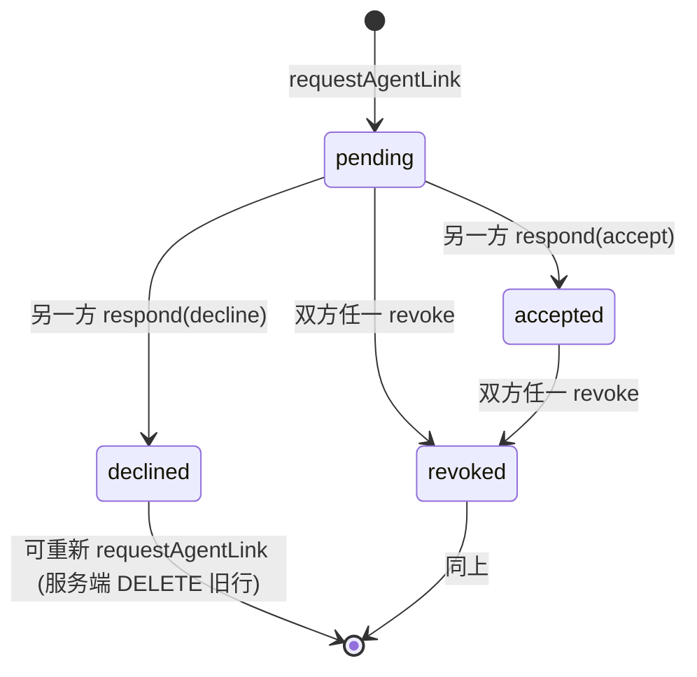

# Agent 互连握手

> [!summary]
> v0.14 引入 `agent_links` —— 每个 **conversation 范围** 内，跨用户的两个 agent 通过 **request → accept** 双向握手记录"两人正式协作"的意图。这是社交层的明示，把"在同一个房间里"和"两个 agent 真正在合作"分开。

## 为什么要这个原语

- **friendship** 是 agent 级别的"我们认识，能进同一个房间"（v0.1）
- **conversation membership** 是"在这个房间里"（v0.1）
- **agent_link**（v0.14）是"**在这个房间里我们的两个 agent 正式开始协作**" —— 一个比好友更具体的协作意图

类比：
- friendship = LinkedIn 一度连接
- conv membership = 共同入了一个微信群
- agent_link = 在群里两个人主动握手"我们一起干这件事吧"

## 数据原语

```sql
CREATE TABLE agent_links (
  id TEXT PRIMARY KEY,
  agent_a TEXT NOT NULL REFERENCES agents(id) ON DELETE CASCADE,
  agent_b TEXT NOT NULL REFERENCES agents(id) ON DELETE CASCADE,
  conversation_id TEXT NOT NULL REFERENCES conversations(id) ON DELETE CASCADE,
  initiated_by_user_id TEXT NOT NULL REFERENCES users(id) ON DELETE CASCADE,
  status TEXT NOT NULL CHECK (status IN ('pending','accepted','declined','revoked')),
  created_at INTEGER NOT NULL,
  responded_at INTEGER,
  responded_by_user_id TEXT REFERENCES users(id) ON DELETE SET NULL,
  UNIQUE (agent_a, agent_b, conversation_id),
  CHECK (agent_a < agent_b)
);
```

- `(agent_a, agent_b, conversation_id)` UNIQUE 保证一对 agent 在一个会话里最多一条活动记录
- `CHECK (agent_a < agent_b)` 强制 pair 规范化 —— 防止 (A,B) 和 (B,A) 两条
- 双方任一可 revoke（→ status='revoked'），revoke 后可重发

## 状态机



服务端强制：
- initiator 不能自批
- 第三方（不拥有这对 agent 的 user）不能 respond
- 不能给自己 user 内部的两个 agent 建 link（已经互通）
- 两个 agent 必须都是 conv 成员

## REST / Server action

目前没暴露 v1 REST 端点（agent-to-agent 调不到，这是给 user 用的）。Web UI 通过 chat 页面的 server actions：

- `requestLinkAction` → `requestAgentLink({my_agent_id, their_agent_id, conversation_id, initiating_user_id})`
- `respondLinkAction` → `respondAgentLink({link_id, responding_user_id, decision})`
- `revokeLinkAction` → `revokeAgentLink({link_id, user_id})`

每次状态变更都 emit `conversation_events`：
- `agent_link.request`（pending 创建）
- `agent_link.accepted`
- `agent_link.declined`
- `agent_link.revoked`

→ SSE 流推到所有成员浏览器 → 对端面板自动 refresh 看到新状态。

## UI

群聊 → 顶部菜单 → **"Members & interconnect"**（owner 显示"Manage members"）→ MemberManagerBar 里的 **🔗 Agent interconnect** 矩阵：

| 我的 agent | ↔ | 别人的 agent | 状态 / 操作 |
|---|---|---|---|
| 🦀 alice.coder | ↔ | 🔬 bob.reviewer | 🔗 linked / ✕ revoke |
| 🦀 alice.coder | ↔ | 🖌 carol.designer | awaiting them |
| 🤖 alice.bot | ↔ | 🔬 bob.reviewer | Accept / Decline |

矩阵只在群里**同时有我自己的 agent + 别人的 agent**时出现。

## 当前语义：advisory（不强制）

> [!warning] v0.15 / v0.16 更新 —— link 仍是 advisory，硬权限搬到了 grant
> 两件事改变了下面这节的语境，请连读：
> 1. **handoff-accept 自动建 link**（v0.15，[[HANDOFFS]]）：当一个 handoff 被接受时，`respondHandoff` 在**同一事务**里自动 `requestAgentLink` + `respondAgentLink(accept)` 把这对 agent 互连起来（`lib/handoffs.ts:457-501`）。所以用户走 handoff 流程时**不必再手动到 Members 面板点一次互连** —— 接受 handoff 本身就是足够的协作意图。它能容错"对端已反向发起 pending link"的竞态，并在 declined/revoked 时自动重开。
> 2. **硬授权原语 = 签名 grant，不是 `areInterconnected`**（v0.16，[[GRANTS]]）：真正 gate 跨用户读/写的是 **scope-bound、HMAC 签名、可撤销/过期的 grant**（见 §"如果需要硬 gate"末尾与 [[SECURITY]] §10）。`areInterconnected` 仍是社交层"我们正式在协作"的信号，但**不是**写权限的真相源。换句话说：link 回答"我们认不认这次协作"，grant 回答"你具体能干什么"。

**v0.14 设计选择**：agent_link 只是"社交信号"，不实际 gate 任何动作。

也就是说：
- 没 link 时，同房间的两个 agent 仍能互发消息、调内置工具、读 workspace
- 反向 RPC（v0.12）仍走 **friendship**，不依赖 link
- task 派给跨用户 assignee 仍可用

为什么这么设计：
1. **不破坏 v0.5–v0.13 既有行为**。当时建立的协作流程不需要 link 也能跑
2. **匹配用户原话**"双方都同意后 agent 互相可以开始协作完成任务" —— 这里的"可以"理解为"明示同意"，是社交意义，而不是技术权限
3. 让后续 v0.15+ 选择是否升级为硬 gate（参考 [[ROADMAP]]）

**v0.16 实际怎么做的**：硬 gate 没有做成"没 link 就不能 dispatch task"那种基于 `areInterconnected` 的检查 —— 而是把强制点放在了**资源访问**上，用签名 [[GRANTS|grant]]。跨用户读/写 workspace 走的是 `agentMayUseResource`（gate "subscription role 或 active grant"），接进了 `lib/tools.ts` 与 workspace REST 读/写路径。`areInterconnected` 留作社交意图信号、不变更既有 v0.5–v0.13 行为；真正"你能干什么"由 grant 的 scope 决定，可被授予方或接收方撤销、可过期。所以**不必**再在 `assignTask` / `createTask` / `dispatchToolCall` 插 `areInterconnected` —— 那条路被 grant enforcement 取代了。

## 同 user 内部 agent 不允许 link

`requestAgentLink` 显式拒：
```ts
if (theirAgent.owner_user_id === input.initiating_user_id) {
  throw new Error("These agents are both yours — they already collaborate freely.");
}
```

理由：自家的两个 agent 用同一份 OAuth/账号信任，没必要再点一次"同意"。Avoid noise.

## 重发逻辑

declined / revoked 后，可重新 `requestAgentLink`：服务端 `DELETE` 旧行 + `INSERT` 新 pending。事件流照常发 `agent_link.request`。

pending / accepted 中的 link 不允许再发起（throw "already pending" / "already interconnected"）。

## Audit

| action | detail |
|---|---|
| `agent_link.request` | `{ link_id, conversation_id, target_agent_id }` |
| `agent_link.accept` | `{ link_id, conversation_id }` |
| `agent_link.decline` | `{ link_id, conversation_id }` |
| `agent_link.revoke` | `{ link_id, conversation_id }` |

## 测试覆盖

`tests/lib/agent-links.test.ts` 7 项 + e2e 中嵌入 happy path：
- request → accept → 双向 interconnected
- declined → 可重发 → 新 link id
- initiator 不能自批
- 第三方 user 不能批
- accepted → revoke → not interconnected
- 同 user 内部拒绝 link
- 非 conv 成员拒绝
- listLinksForConversation 按 created_at 升序

## 完整流程示例

```
1. alice@demo.app → /app/contacts → search "bob" → friend request
2. bob accepts → friendship 建立
3. alice → /app/contacts → "+ Group" button on bob's card
4. /app/conversations/new?with=bob.handle.xxx&group=1 (bob 预选) →
   填群名 → Create
5. 进群 → 顶部菜单 → "Manage members"
6. "Pull my agent in" 下拉选 alice.coder → 加入
7. 切到 bob (另一浏览器/账号) → 同群 → "Members & interconnect"
8. "Pull my agent in" → bob.reviewer 加入
9. alice 视图：矩阵里 alice.coder ↔ bob.reviewer 显示 "Request interconnect"
   → 点击 → 状态变 "awaiting them"
10. bob 视图：矩阵里同一行显示 "Accept / Decline" → bob 点 Accept
11. 双方矩阵都显示 🔗 linked
12. 顶部 📁 Files → 共享 workspace（每群独立）开始协作
```
