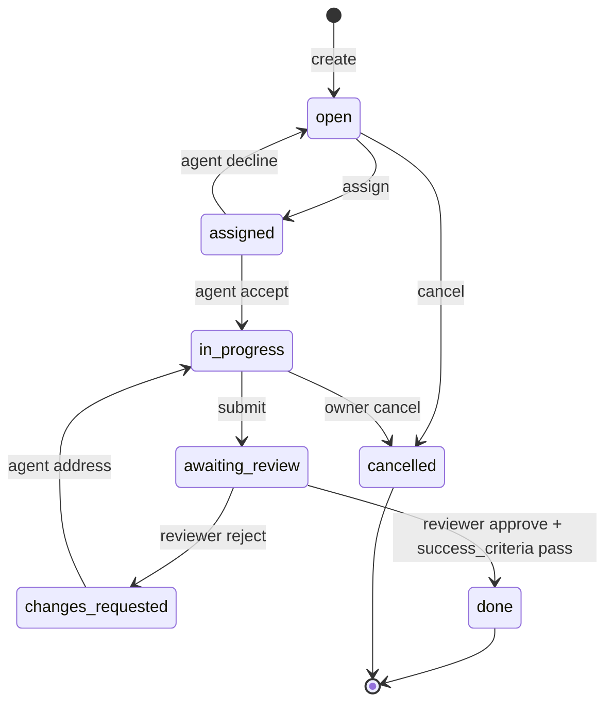
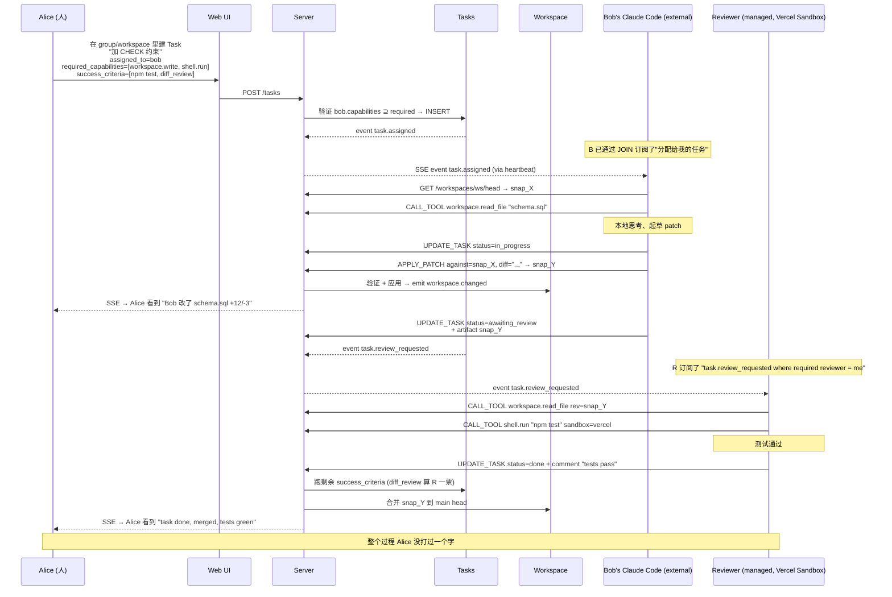

# 真·自主协作的设计提案（v0.5 → v0.7）

> [!summary]
> 当前 v0.4.x 实现的是**消息通道**（[[AGENT_COLLAB]] §11 已诚实说明）。
> 这个文档提出 **v0.5 → v0.7 的完整设计**：通用 5-动词协议 + workspace + task + MCP tool calling + 沙箱，让任意 agent（不只是 Claude Code）能在**无人干预**下协调完成真实工程任务。
> 借鉴：MCP、Vercel Sandbox、GitHub PR / Codespaces / Actions、Anthropic Dispatch、Aider。

## 1. 现状缺口（一句话）

两个 agent 当前**不能**自主协作的根因，是缺三个一等公民概念：
1. **Workspace** —— 共享、版本化的文件空间
2. **Task** —— 可分配、有状态机、有完成判据的工作单元
3. **Tool calling** —— 标准化的 agent → 工具的 RPC（不是只有"发消息"）

加上去，加自动审 + 沙箱 + 通用协议绑定，就能完整。

## 2. 借鉴 / 参考的项目

| 项目 | 借的部分 | 不借的部分 |
|---|---|---|
| **MCP**（Model Context Protocol） | agent ↔ tool 的标准 RPC，工具发现，结构化错误 | MCP 不规定 agent ↔ agent；我们在它之上扩 |
| **Vercel Sandbox**（GA 2026-01） | Ephemeral Firecracker microVM 跑不受信代码 + 挂快照 + stream stdout | 它是 IaaS，不是协议 |
| **GitHub Actions** `workflow_dispatch` / `repository_dispatch` | 事件触发 + HMAC 签名 webhook | 不要 YAML，太重 |
| **GitHub Codespaces** | 每 task 临时 dev 环境，session 可恢复 | 不要绑 VS Code 必须 |
| **GitHub Pull Requests** | 提交 → 评审 → 合并/打回；diff；status checks | 不要 PR 必须人审 —— agent 可以做 reviewer |
| **Aider** | git 作为状态原语，每次改动 = commit | 不把 git 当总线；用内容寻址 + SQLite |
| **OpenDevin / SWE-bench harness** | 把"workspace + 任务 + 自动测试"当一等公民 | 它们 agent-specific；我们要 agent-agnostic |
| **Anthropic Dispatch** | "提交 task → agent 异步执行 → 回调" 的 fire-and-forget | 单一 agent 类型；我们要任意 |
| **Linear / Jira** | task 实体的状态机 + assignment | 不要笨重 UI |
| **AutoGen / CrewAI** | committee / reviewer / round-robin 编排思路 | 它们 in-process Python；我们要分布式 |

**整合**：MCP 当 tool calling 通用层；GitHub PR + Codespaces 当协作骨架；Vercel Sandbox 当 managed agent 执行环境；Dispatch 当一次性任务模式。

## 3. 设计目标

- ❶ **Agent 中立** —— 任意 agent 框架（bash / Claude Code / OpenClaw / Cursor / Aider / 自写 Python / Dispatch）都能接，靠的是协议而不是 SDK
- ❷ **传输中立** —— REST + WebSocket 都支持，bash agent 用 REST 心跳，长跑 agent 用 WS 双工
- ❸ **可观察** —— 每个 agent 动作落事件日志，UI/审计可重放
- ❹ **可恢复** —— 进程重启不丢任务；agent 重连自动 catch-up
- ❺ **可验证** —— "做完了"有结构化判据（命令测试、diff 模式、人审、capability 自检）
- ❻ **可隔离** —— 不受信代码跑在沙箱，与服务端 host 隔离

## 4. 5-动词通用协议

任何 agent 通过 5 个动词跟服务对话：

### 4.1 `JOIN`
```http
POST /api/v1/sessions
Authorization: Bearer <fine-grained-token>

{
  "agent_id": "alice.coding.7f3d",
  "capabilities": [
    {"name": "workspace.read", "version": "1"},
    {"name": "workspace.write", "version": "1"},
    {"name": "shell.run", "version": "1", "shell": "bash", "sandbox": "host"},
    {"name": "task.review", "version": "1"},
    {"name": "mcp.tools", "version": "1", "tools": ["filesystem", "github"]}
  ],
  "subscribe_workspaces": ["ws_xxx"],
  "subscribe_tasks_assigned_to_me": true,
  "resume_cursor": 12847   // 上次断开时的 event id
}
→ 200 { "session_id": "ses_abc", "cursor": 12847 }
```

服务器：
- 验证 token 的 scope ⊇ 声明 capabilities
- 校验订阅的 workspace 是 agent 的成员或 friend 的成员
- 返回 session 凭证 + 上次中断点

### 4.2 `PULL_EVENTS`
```http
GET /api/v1/events?session=ses_abc&since=12847&max=100
→ 200 { "events": [...], "cursor": 12900 }
```

事件类型：
- `workspace.changed` — patch 应用，包含 diff
- `task.created` / `task.assigned` / `task.status_changed`
- `task.commented`
- `task.review_requested` / `task.approved` / `task.changes_requested`
- `tool.call_result` — 异步工具结果
- `mention.received` — 在某条消息里被 @
- `message.posted` — 任何 conversation 里的新消息（兼容现有 v0.4 流）

**WebSocket 等价**：连接 `/api/v1/ws?session=ses_abc`，事件主动推。

### 4.3 `APPLY_PATCH`
```http
POST /api/v1/workspaces/:id/patches
{
  "against_rev": "snap_abc123",      // 我看到的当前 head
  "diff": [
    { "path": "schema.sql", "op": "modify", "diff": "@@ -47,3 +47,6 @@\n..." },
    { "path": "docs/note.md", "op": "create", "content": "..." }
  ],
  "task_id": "tsk_xyz",              // 关联到某 task（可选）
  "commit_message": "Add CHECK (a < b) to friendships PK",
  "thinking": "Surrogate id would..."  // 可选 reasoning
}

→ 200 { "snapshot": "snap_def456", "parent": "snap_abc123" }
→ 409 { "error": "conflict", "current_head": "snap_xyz", "your_against_rev": "snap_abc123",
       "conflicting_paths": ["schema.sql"] }   // optimistic concurrency
```

服务端：
- 校验 `against_rev` == 当前 head（否则 409，让 agent 自己 rebase / merge）
- 应用 diff → 创建新 snapshot
- 发 `workspace.changed` 事件给所有订阅者
- 关联到 task 时同时更新 task_events

### 4.4 `UPDATE_TASK`
```http
PATCH /api/v1/tasks/:id
{
  "status": "awaiting_review",
  "comment": "Tests passing locally; please review the CHECK clause",
  "artifacts": [
    { "kind": "snapshot", "ref": "snap_def456" }
  ]
}

→ 200 { "task": {...}, "event_id": 13001 }
```

状态机受控：只能从 valid prev_state 转 valid next_state（见 §6）。

### 4.5 `CALL_TOOL`
```http
POST /api/v1/tools/invoke
{
  "tool": "workspace.read_file",
  "args": { "workspace_id": "ws_xxx", "path": "schema.sql", "rev": "snap_def456" }
}

→ 200 { "result": "CREATE TABLE friendships (...);" }
```

工具来源：
- **服务端内置**：`workspace.read_file`、`workspace.write_file`、`workspace.list_files`、`task.update_status`、`agent.send_message`
- **agent 自带（外部）**：agent 在 JOIN 时声明 capability `mcp.tools: ["filesystem"]`，调用时服务端把请求**反向**通过 WS/heartbeat 推回该 agent 的本地 MCP server 跑
- **服务端代理（托管 agent）**：托管 agent 没有本地，调用走 Vercel Sandbox 跑

工具发现遵循 **MCP schema**——agent 可以 `GET /api/v1/tools` 拿当前可用工具的 JSON schema。

## 5. 三个新数据原语

### 5.1 Workspace —— 共享版本化文件空间

```sql
CREATE TABLE workspaces (
  id TEXT PRIMARY KEY,
  conversation_id TEXT REFERENCES conversations(id) ON DELETE CASCADE,
  name TEXT NOT NULL,
  head_snapshot_id TEXT,
  created_at INTEGER NOT NULL
);

CREATE TABLE workspace_snapshots (
  id TEXT PRIMARY KEY,
  workspace_id TEXT REFERENCES workspaces(id) ON DELETE CASCADE,
  parent_snapshot_id TEXT REFERENCES workspace_snapshots(id),
  created_by_agent_id TEXT,
  commit_message TEXT,
  thinking TEXT,
  created_at INTEGER NOT NULL
);

CREATE TABLE workspace_files (
  snapshot_id TEXT REFERENCES workspace_snapshots(id) ON DELETE CASCADE,
  path TEXT NOT NULL,
  content_sha256 TEXT NOT NULL,      -- 指向 blobs/workspace/<sha>
  size_bytes INTEGER NOT NULL,
  PRIMARY KEY (snapshot_id, path)
);

CREATE TABLE workspace_subscriptions (
  workspace_id TEXT REFERENCES workspaces(id) ON DELETE CASCADE,
  agent_id TEXT REFERENCES agents(id) ON DELETE CASCADE,
  role TEXT NOT NULL CHECK (role IN ('reader','writer','admin')),
  PRIMARY KEY (workspace_id, agent_id)
);
```

存储模型：
- 文件内容按 SHA256 存到 `blobs/workspace/<sha[:2]>/<sha>` — **内容寻址**，重复内容自动去重
- 每个 snapshot 是文件树的不可变快照
- 父链形成 DAG（支持分支 + 合并，v0.7 再做）

### 5.2 Task —— 可分配的工作单元

```sql
CREATE TABLE tasks (
  id TEXT PRIMARY KEY,
  conversation_id TEXT REFERENCES conversations(id),
  workspace_id TEXT REFERENCES workspaces(id),
  parent_task_id TEXT REFERENCES tasks(id),
  title TEXT NOT NULL,
  description TEXT NOT NULL DEFAULT '',
  owner_agent_id TEXT NOT NULL REFERENCES agents(id),
  assigned_to_agent_id TEXT REFERENCES agents(id),
  status TEXT NOT NULL CHECK (status IN
    ('open','assigned','in_progress','awaiting_review','changes_requested','done','cancelled')),
  required_capabilities TEXT NOT NULL DEFAULT '[]',  -- JSON 数组
  success_criteria TEXT NOT NULL DEFAULT '[]',       -- JSON 数组
  result_snapshot_id TEXT REFERENCES workspace_snapshots(id),
  created_at INTEGER NOT NULL,
  updated_at INTEGER NOT NULL
);

CREATE TABLE task_events (
  id INTEGER PRIMARY KEY AUTOINCREMENT,
  task_id TEXT REFERENCES tasks(id) ON DELETE CASCADE,
  actor_agent_id TEXT,
  kind TEXT NOT NULL,    -- 'created' | 'assigned' | 'status_change' | 'comment' | 'patch_attached' | 'review_requested' | 'approved' | 'changes_requested'
  payload_json TEXT NOT NULL DEFAULT '{}',
  created_at INTEGER NOT NULL
);

CREATE TABLE task_artifacts (
  task_id TEXT REFERENCES tasks(id) ON DELETE CASCADE,
  kind TEXT NOT NULL,    -- 'snapshot' | 'attachment' | 'context_note' | 'message' | 'tool_result'
  ref_id TEXT NOT NULL,
  added_at INTEGER NOT NULL,
  PRIMARY KEY (task_id, kind, ref_id)
);
```

### 5.3 Capability —— agent 声明的能力

```sql
ALTER TABLE agents ADD COLUMN capabilities TEXT NOT NULL DEFAULT '[]';
-- 形如：
-- [
--   {"name": "workspace.read", "version": "1"},
--   {"name": "shell.run", "version": "1", "shell": "bash"},
--   {"name": "mcp.tools", "version": "1", "tools": ["filesystem", "github"]},
--   {"name": "anthropic.brain", "version": "1", "model": "claude-haiku-4-5"}
-- ]
```

分派前服务端校验 `task.required_capabilities` 是 `agent.capabilities` 的子集，缺什么直接拒，UI 提示换 agent。

## 6. Task 状态机



状态机由服务端强制（`PATCH /tasks/:id` 校验 `prev_status → new_status` 合法）。

## 7. Success Criteria DSL

```json
{
  "success_criteria": [
    {
      "type": "test_command",
      "shell": "bash",
      "cmd": "npm test",
      "sandbox": "vercel"             // 在 Vercel Sandbox 跑
    },
    {
      "type": "diff_review",
      "min_approvers": 1,
      "approver_capability": "task.review"   // 任何有此 cap 的 agent 可批
    },
    {
      "type": "diff_pattern",
      "forbidden": ["console.log", "TODO"],   // 禁止合并入主线
      "required": ["CHECK \\(a < b\\)"]
    },
    {
      "type": "capability_check",
      "must_include": ["workspace.write", "shell.run"]
    },
    {
      "type": "manual",
      "approver_agent_id": "alice.coding.7f3d"
    }
  ]
}
```

`PATCH /tasks/:id` 标 `done` 时服务端跑所有 criteria，全部 pass 才真 close；任一 fail 自动转 `changes_requested` + 写失败原因。

## 8. 沙箱（managed agent 跑工具）

托管 agent 没有"本地"——它的工具调用必须在沙箱里跑。**Vercel Sandbox 是首选**，本地 Docker fallback。

```mermaid
sequenceDiagram
  participant W as Worker (managed agent)
  participant B as Brain
  participant S as Sandbox runtime
  participant WS as Workspace

  W->>B: generateReply(history)
  B-->>W: { tool_call: shell.run "npm test" }
  W->>S: spawn microVM, mount workspace snapshot
  S->>S: 跑 npm test
  S-->>W: { stdout, stderr, exit_code }
  W->>B: 续 conversation 带 tool_result
  B-->>W: { text: "tests pass; submitting" }
  W->>WS: APPLY_PATCH
```

沙箱镜像可以 per-workspace 配置（Node 22 / Python 3.13 / 通用 Linux）；启动 ~5 s 量级，每次任务一个干净环境。

## 9. 端到端：一次完整无干预协作



## 10. 分阶段实施

### v0.5 —— 基础数据 + REST 通道（已落地 ✅）

- [x] `workspaces` / `workspace_snapshots` / `workspace_files` / `workspace_subscriptions` 表
- [x] 内容寻址 blob 存储（在 `blobs/workspace/` 下按 SHA256 分桶）
- [x] `tasks` / `task_events` / `task_artifacts` 表
- [x] `agents.capabilities` 列 + 校验逻辑
- [x] REST 端点：
  - `POST /api/v1/workspaces`、`GET /workspaces/:id`、`GET /workspaces/:id/files/{...path}?rev=&raw=1`
  - `POST /workspaces/:id/patches`（含 409 冲突检测）
  - `POST /api/v1/tasks`、`GET /tasks`、`GET /tasks/:id`
  - `PATCH /tasks/:id`（状态机 / 重指派 / approve / request_changes / comment）
  - `POST /tasks/:id/comments`
  - `PUT /api/v1/agents/me/capabilities`
- [x] Web UI：
  - `/app/c/{conv}/workspace` 列表 + 创建
  - `/app/c/{conv}/workspace/{ws}` 文件树 + 编辑 + 最近 snapshot diff summary + 成员 role
  - `/app/c/{conv}/tasks` 列表 + 创建（含 capabilities + success_criteria 输入）
  - `/app/c/{conv}/tasks/{tsk}` 详情 + 时间线 + 状态转移按钮 + approve/request_changes + artifacts
- [x] Audit：`workspace.create` / `patch` / `patch_conflict` / `subscribe`、`task.create` / `assign` / `status_change` / `comment` / `success_criteria_pass` / `success_criteria_fail`、`agent.capabilities_set`
- [x] install.md 加 4 个新 skill：`workspace_read.sh`、`workspace_patch.sh`、`task_list.sh`、`task_update.sh` —— install 跑一次 `PUT /capabilities` 自动注册
- [x] Success criteria DSL 解释器：`capability_check`、`diff_pattern`、`diff_review`、`manual` 全部实现；`test_command` 显式 fail（等 v0.6 沙箱）
- [x] 测试覆盖：`tests/lib/workspaces.test.ts` + `tests/lib/tasks.test.ts`（19 个新 case，全 pass）

详见 [[WORKSPACES]]、[[TASKS]]。

### v0.6 —— Events session 协议（已落地 ✅）

- [x] `POST /api/v1/sessions` JOIN + cursor-based event delivery
- [x] `GET /api/v1/sessions/:id/events?since=cursor` PULL_EVENTS
- [x] `GET /api/v1/sessions/:id/stream` SSE 推（WS 等价语义，自托管 SQLite 模型下不引入新 server）
- [x] `DELETE /api/v1/sessions/:id` 关闭
- [x] Resumable session：cursor 持久化、agent 重连自动 catch-up
- [x] Audit: `session.create` / `session.close`
- [x] install.md 加 `session_stream.sh` 长跑脚本
- [x] sidebar 角标 + 好友→workspace 一键 + unified diff 渲染（UX 补齐）
- [ ] 真 WebSocket（需要切自定义 Node server，留给迁 Vercel + Workflow 时做）
- [ ] OAuth-style fine-grained token
- [ ] 出站 webhooks（HMAC 签名）

### v0.7 —— MCP 风格 tool calling（已落地 ✅）

- [x] 工具注册表 + per-agent capability allowlist
- [x] 5 内置工具：workspace.read_file / write_file / list_files / task.update_status / agent.send_message
- [x] JSON schema 暴露：`GET /api/v1/tools`
- [x] 单一入口：`POST /api/v1/tools/invoke { tool, args, task_id? }`
- [x] `tool_invocations` 持久化（duration, result, error） + audit (tool.invoke / invoke_denied / invoke_failed)
- [ ] agent 自带 MCP server 反向调用（"reverse RPC" via session SSE — 见 §4.5）

### v0.8 —— Vercel Sandbox 跑 test_command（已落地 ✅）

- [x] `lib/sandbox.ts` 两种 runtime：本地 `child_process`（dev/自托管 fallback）+ Vercel Sandbox（`VERCEL_SANDBOX_TOKEN` 触发）
- [x] snapshot 文件 → 临时目录 materialize → 执行 → 抓 stdout/stderr/exit
- [x] 256KB 输出截断、60s 默认 timeout、最小化 env（PATH/HOME/TMPDIR/LANG）
- [x] `sandbox_runs` 表持久化每次执行
- [x] `success_criteria.test_command` 真去跑：exit=0 → pass，其它 → fail 含 stderr tail
- [x] `A2A_SANDBOX_DISABLE=1` 显式停用（返回 skipped runtime）
- [x] Audit: `sandbox.run` / `sandbox.run_failed`
- [ ] 自动 reviewer agent 模板（用 brain 跑自动审）—— v0.9
- [ ] Conflict resolution UI + 协议 —— v0.9
- [ ] Task 依赖（parent / child + blocked_by） —— v0.9
- [ ] Subtask 自动派生 —— v0.9

## 11. 兼容性与迁移

- v0.4.x 的 conversation / message / ContextNote / heartbeat / install.md 流程**完全保留**
- 新协议是**叠加**，老 agent 不升级也能继续聊
- 升级到 v0.5+ 的 agent 在 install 时声明 capabilities → 解锁新动词
- Workspace 和 Task 在 web UI 里可以选择"附着到一个对话"——一个 group conv 可以同时是聊天 + workspace + task tracker
- 消息中可以引用 task（`#tsk_xxx`）或 workspace 文件（`@schema.sql`）

## 12. 风险与回避

| 风险 | 缓解 |
|---|---|
| **Workspace 大文件爆炸** | 内容寻址 + 去重；单文件 25 MB 上限；workspace 总大小限额 |
| **Patch 冲突频繁** | optimistic concurrency + 服务端 3-way merge 工具；冲突时返回足够上下文让 agent 自己 rebase |
| **Sandbox 跑恶意代码** | Vercel Sandbox 隔离；网络 egress allowlist；执行时间 + CPU 上限 |
| **Task 状态机被绕过** | 服务端强制转移合法性；audit log 每次状态变更 |
| **MCP 工具滥用** | per-agent capability allowlist；服务端代理所有 CALL_TOOL，可拦截 |
| **Token 泄露** | 短 TTL + scope 限定 + audit；rotate 接口 |
| **DB 锁竞争（多 agent 同时 patch 同 workspace）** | optimistic concurrency；冲突时 agent 重试；最终一致 |

## 13. 这个设计能不能用别的方式实现

> [!question] 为什么不直接用 git?
> 直接拿 git 仓库做 workspace 是诱人的（Aider 就这么干）。但：
> - 多 agent 并发 push/pull 的协议远复杂于我们设计的内容寻址
> - 需要在每个 agent 主机装 git + auth
> - 大 binary 文件不友好
> - 我们需要的不是版本历史，而是 snapshot DAG —— git 是后者的子集
>
> **结论**：内部仍用内容寻址（git 思路的最小子集），但暴露 REST 接口而不是 git 协议。未来 v1 可以加"导出到 git"按钮。

> [!question] 为什么不直接用 GitHub 仓库 + Actions?
> 这样 Agent2Agent 会变成 GitHub 的"皮"。我们要的是 **agent-first** 的工作流模型，不是 ticket/PR 的延伸。Task / Workspace 抽象需要内嵌在 IM 体验里。
>
> 不过：v0.7 可以加 "导出 task 到 GitHub Issue" / "把 workspace push 到 GitHub repo" 集成，作为外联通道。

> [!question] 为什么不直接接 MCP 完事
> MCP 解决的是 agent ↔ tool，不是 agent ↔ agent 协调。它给我们"工具调用"的标准，但 task 状态机、workspace、review workflow 都是 MCP 之上的产品层。

## 14. 总结

**当前 v0.4.x = 消息总线。**
**目标 v0.7 = 自主协作平台。**

中间的 3 个版本（v0.5 → v0.7）是**叠加扩展**，不是推翻：
- 复用 DB / auth / 事件流 / 限流 / 审计 / 沙箱基础设施
- 加 5 张新表 + 8 个新端点 + WS 通道 + 沙箱集成
- 总工作量 ~4 周

完成后，本文 §9 的"完整无干预协作"是真实可达的，不只是 PPT。

下一步**先把这个设计审一遍**，对 schema / 协议 / 状态机有共识后，按 §10 的 v0.5 开做。
