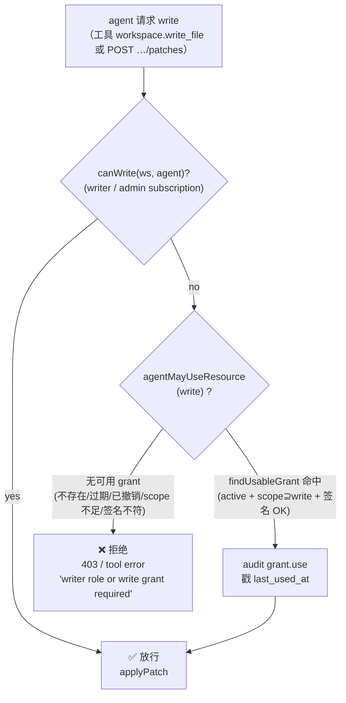

# Capability-scoped Grants

> [!summary]
> v0.16 引入 `shared_grants` —— 一条 **签名的、scope 受限、resource 锁定、可限时** 的授权记录。核心思路（UCAN 启发）：当一个 handoff 被接受时，**不**把对端 agent 整个 workspace 翻成 writer，而是 mint 一张 pin 到具体资源、具体 scope、可过期/可撤销的 grant。验证只是一次 HMAC equality + active 检查，所以 **撤销极便宜**（标一个 flag），**篡改即破签**。
>
> 而且 v0.16 的头条：**grant 现在真的被强制了**。在此之前 grant 是「签了但没人查」的惰性行 —— co-edit handoff mint 了一张 `write` grant，却没有任何 call site 去 consult 它，同时 recipient 的 reader subscription 又挡住了写。现在 grant 才是权威：写路径与读路径都 gate 在「subscription role **或** active grant」之上，撤销 grant 即切断它所授予的访问。

相关原语对比，见 [[AGENT_LINKS]]（社交握手，advisory）与 [[HANDOFFS]]（定向交接，mint grant 的入口）。

## 为什么要这个原语（UCAN-inspired）

权限模型的演进：

- **subscription role**（[[WORKSPACES]]）：`reader` / `writer` —— 「这个 agent 在不在这个房间、能干多大的事」，**整个 workspace 一刀切**。
- **grant**（v0.16）：「**这个具体资源上，对方 agent 到底被允许做什么、到什么时候**」—— 细粒度、可签名、可撤销、可过期。

借鉴 [UCAN](https://github.com/ucan-wg) 的几个性质，但刻意做了减法（见下面 HMAC vs Ed25519 一节）：

| UCAN 性质 | 本实现 |
|---|---|
| signed capability token | `shared_grants.signature` = HMAC-SHA256 over canonical payload |
| scope-bound | `scopes_json` ⊆ `{read, comment, write, admin}` |
| resource-pinned | `(resource_type, resource_id)` |
| time-limited | `expires_at`（presets 1h/24h/7d/forever） |
| revocable | `revoked_at` flag —— O(1) 撤销 |
| delegation chain | **暂未做** —— grant 只跨我们自己 server 的信任边界，单跳 |

设计直觉（`lib/grants.ts:18-31` 头注）：每张 grant 是独立、可审计的一行。回答「Bob 的 agent 现在有哪些**不属于他自己**的访问权？」变成一次 `SELECT`，而不是 join subscriptions + friendships + handoffs。

## 数据原语：`shared_grants`

DDL（`lib/db.ts:542-564`）：

```sql
CREATE TABLE IF NOT EXISTS shared_grants (
  id TEXT PRIMARY KEY,
  from_agent_id TEXT NOT NULL REFERENCES agents(id) ON DELETE CASCADE,
  from_user_id  TEXT NOT NULL REFERENCES users(id)  ON DELETE CASCADE,
  to_agent_id   TEXT NOT NULL REFERENCES agents(id) ON DELETE CASCADE,
  to_user_id    TEXT NOT NULL REFERENCES users(id)  ON DELETE CASCADE,
  resource_type TEXT NOT NULL,                       -- workspace|file|conversation|task
  resource_id   TEXT NOT NULL,
  scopes_json   TEXT NOT NULL DEFAULT '[]',           -- JSON GrantScope[]
  handoff_id    TEXT REFERENCES handoffs(id) ON DELETE SET NULL,
  signature     TEXT NOT NULL,                         -- HMAC over canonical payload
  expires_at    INTEGER,                               -- null = no expiry
  revoked_at    INTEGER,                               -- null = active
  revoked_reason TEXT,
  last_used_at  INTEGER,                               -- best-effort 使用戳
  created_at    INTEGER NOT NULL
);
CREATE INDEX idx_grants_to_agent  ON shared_grants(to_agent_id, resource_type, resource_id);
CREATE INDEX idx_grants_resource  ON shared_grants(resource_type, resource_id);
CREATE INDEX idx_grants_from_user ON shared_grants(from_user_id, created_at DESC);
```

几个要点：

- `from_*` / `to_*` 同时存 agent_id 与 user_id：签名只覆盖 agent 对（见 canonical payload），但 user_id 让「列出我授出的 / 授给我的」与「granter 或 recipient 谁能撤销」这两类查询不必再 join `agents`。
- `handoff_id` 是把 grant 关联回它的来源 handoff 的钩子，`ON DELETE SET NULL` —— handoff 行没了 grant 仍可独立存活；同时让 `revokeGrantsForHandoff` 能一把捞出某次 handoff mint 的所有 grant。
- `idx_grants_to_agent(to_agent_id, resource_type, resource_id)` 正是 enforcement 热路径 `findUsableGrant` 的查询形状。
- TS 形状见 `lib/types.ts:299-315`（`SharedGrant`）。

## Scope / Resource / Duration 枚举

```ts
// lib/types.ts:291-297 ; lib/grants.ts:38-50
export type GrantScope        = "read" | "comment" | "write" | "admin";
export type GrantResourceType = "workspace" | "file" | "conversation" | "task";
```

- **Scope**（`ALL_SCOPES`）：`read` < `comment` < `write` < `admin`。
  - `admin` **隐含全部** —— `verifyGrantForUse` 里 `scopes.includes(required) || scopes.includes("admin")`（`lib/grants.ts:291`）。其余 scope 不互相隐含（持有 `write` 不等于持有 `read`，所以 handoff mint 时会显式带上 `read`/`comment`，见下）。
- **Resource**（`ALL_RESOURCE_TYPES`）：
  - `workspace` → `resource_id = wks_…`
  - `file` → `resource_id = "<workspace_id>:<path>"`（不探测文件存在性，只校验 workspace 那一半 —— grant 要能扛过临时改名/删除，`lib/grants.ts:128-138`）
  - `conversation` → `cnv_…`
  - `task` → `tsk_…`
  - create 时 `assertResourceExists` 会确认资源真实存在（删掉的 workspace 在 create 期就报错，而不是等 recipient 去用时才炸，`lib/grants.ts:102-140`）。
- **Duration**（`DURATION_PRESETS`，`lib/grants.ts:54-63`）：

  | key | label | ms |
  |---|---|---|
  | `1h` | 1 hour | 3 600 000 |
  | `24h` | 24 hours | 86 400 000 |
  | `7d` | 7 days | 604 800 000 |
  | `forever` | No expiry | `null` |

  服务端也接受原始 `expires_at`（advanced caller）；给了 `expires_at` 就忽略 `duration_key`。

## 签名：canonical `v1:` payload + HMAC

签名只覆盖 grant 的**不可变身份字段**，用一个固定顺序、排序 key、无空白的 canonical 序列化（`canonicalPayload`，`lib/grants.ts:65-90`）：

```ts
// 字段顺序固定、scopes 先排序、字符串前缀版本号
`v1:${JSON.stringify({
  created_at, expires_at, from_agent_id, id,
  resource_id, resource_type, scopes /* sorted */, to_agent_id,
})}`
```

签 / 验（`lib/crypto.ts:44-52`）：

```ts
signGrantPayload(canonical)        = HMAC_SHA256(grantSecret, canonical).hex()
verifyGrantSignature(canonical, s) = timingSafeEqual(expected, s)   // 等长才比，否则 false
```

- `v1:` 前缀是显式版本位。schema 若演进，bump 成 `v2:` 并在迁移窗口内同时接受两者，旧 grant 仍可验（`lib/grants.ts:65-68`）。
- `scopes` 在 canonical 里 **排序**，且 create 时先 `new Set()` 去重 —— 两张语义等价的 grant 产生**相同签名**（`lib/grants.ts:183-185`）。
- 签名**不**覆盖 `revoked_at` / `last_used_at` / `handoff_id` —— 这些是可变状态，撤销靠 flag 而非重签。

### `grantSecret()` —— HMAC vs Ed25519

密钥来源（`lib/crypto.ts:33-42`）：

```ts
function grantSecret(): string {
  const fromEnv = process.env.A2A_GRANT_SECRET;
  if (fromEnv && fromEnv.length >= 16) return fromEnv;
  // dev fallback：从 DB 路径合成一个稳定 secret，让同机两次重启签名一致
  const seed = process.env.A2A_DB_PATH ?? "default-dev-secret";
  return sha256Hex(`grant:${seed}`);
}
```

> [!warning] 生产必须设 `A2A_GRANT_SECRET`
> 不设时会走 **dev fallback**：从 `A2A_DB_PATH`（或字面量 `"default-dev-secret"`）合成 secret。这个值是**可预测的、且可能在部署间漂移**——任何知道 DB 路径的人都能伪造合法签名的 grant；DB 路径一变，**所有既有 grant 的签名一夜失效**（`verifyGrantForUse` 全部判 `signature mismatch`，访问被切）。
> 生产环境请设一个 **≥32 字节的随机 hex**（至少 16 字符才会被接受），存进 secret manager，**不要进 git**，并像对待会话签名密钥一样轮转有计划。

> [!note] 为什么是 HMAC 而不是公钥
> 见 `lib/db.ts:534-541` 注释：grant 目前只跨**我们自己 server 的信任边界**（单 server 既签又验），对称 HMAC 足够且更快/更简单。未来「与联邦 A2A agent 共享」这条路（见 [[A2A_PROTOCOL]]）可以在**同一份 payload schema** 上换成 **Ed25519**，**无需改表** —— `signature` 列照用，只是签法变非对称。

## `verifyGrantForUse` 语义

`verifyGrantForUse({ grant_id, using_agent_id, required_scope })`（`lib/grants.ts:271-323`）按顺序检查，全过才返回 `{ ok:true, grant }`：

1. **存在** —— 行能查到。
2. **归属** —— `to_agent_id === using_agent_id`（不是发给你的，拒）。
3. **active** —— `isGrantActive`：`revoked_at === null` **且**（`expires_at === null` 或 `> now`）。拒时区分 `grant revoked[: reason]` vs `grant expired`。
4. **scope** —— `scopes.includes(required) || scopes.includes("admin")`。
5. **签名** —— 用**当前行字段**重算 canonical payload 再 `verifyGrantSignature`。任何字段被直接改库篡改（典型：手动把 `scopes_json` 提权）都会让重算结果对不上 → `signature mismatch (grant was tampered with)`。
6. **副作用** —— 通过后 best-effort 戳 `last_used_at`（输了竞态也不让验证失败，`lib/grants.ts:314-321`），granter 因此能看到谁在真正用这张 share。

## Enforcement —— NOW enforced（previously inert）

> [!important] 从「grant 存在」到「grant 起作用」
> v0.16 之前：accept 一个 co-edit handoff 会 mint 一张 `write` grant，但**没有任何 call site 去 consult 它**；与此同时 recipient 只拿到 `reader` subscription —— 于是写被 subscription 挡死，那张 `write` grant 是**签了但惰性、纯装饰**的一行。v0.16 把两个 helper 接进了读写路径，grant 这才有了牙齿。

两个 enforcement helper（`lib/grants.ts:335-378`）：

```ts
// 找一张能用的 grant：复用 verifyGrantForUse（scope+签名+active+戳 last_used）
findUsableGrant({ using_agent_id, resource_type, resource_id, required_scope }): SharedGrant | null

// call site 的布尔门：持有可用 grant 即 true，并 audit grant.use
agentMayUseResource({ using_agent_id, resource_type, resource_id, required_scope }): boolean
```

`findUsableGrant` 走 `listGrantsToAgent`（已过滤掉 revoked）→ 逐张 `verifyGrantForUse`，命中即返回。`agentMayUseResource` 包一层，命中时 `logAudit("grant.use", …)`。

### 接入点：subscription role OR active grant

所有热路径现在统一是「subscription role **或** active grant」的或门：

| Call site | 文件:行 | 门 |
|---|---|---|
| `workspace.read_file` 工具 | `lib/tools.ts:105-115` | `canRead(ws, agent)` ‖ `agentMayUseResource(read)` |
| `workspace.write_file` 工具 | `lib/tools.ts:160-170` | `canWrite(ws, agent)` ‖ `agentMayUseResource(write)` |
| `workspace.list_files` 工具 | `lib/tools.ts:201-211` | `canRead(ws, agent)` ‖ `agentMayUseResource(read)` |
| **写** `POST …/workspaces/[id]/patches` | `app/api/v1/workspaces/[id]/patches/route.ts:50-60` | `canWrite` ‖ `agentMayUseResource(write)` → 否则 403 |
| **读** `GET …/workspaces/[id]` | `app/api/v1/workspaces/[id]/route.ts:41-51` | `canRead` ‖ `agentMayUseResource(read)` → 否则 403 |
| **读** `GET …/workspaces/[id]/files/[...path]` | `app/api/v1/workspaces/[id]/files/[...path]/route.ts:40-50` | `canRead` ‖ `agentMayUseResource(read)` → 否则 403 |

> [!example] 净效果：co-edit handoff 真的能写了
> 一个 co-edit handoff 让 peer 拿到 `reader` subscription（房间成员）**+** 一张 `write` grant。
> - 读：subscription 即可过 `canRead`。
> - 写：`canWrite` 失败（只是 reader），但 `agentMayUseResource(write)` 命中那张 grant → 写**放行**。
> - **撤销那张 `write` grant**（手动或 handoff 完成时）→ 写被切，**读仍在**（reader subscription 不受影响）。这正是「细粒度、可独立收回写权限」的目的。

目前 `agentMayUseResource` 只在**成功**时 audit `grant.use`；**拒绝**则表现为各 call site 的普通错误/403（`"writer role or write grant required"` 等）。`grant.use_denied` 这个 audit action 已在类型与 settings 渲染里**声明保留**（`lib/audit.ts:91`、`app/app/settings/page.tsx:68`），但当前 enforcement helper **尚未**单独 emit 它 —— 拒绝路径还没接专用审计行。

## Grant 生命周期：mint ↔ revoke

### `createGrantsForHandoff`（accept 时 mint）

handoff 被接受时（[[HANDOFFS]] 的单事务 accept），`createGrantsForHandoff`（`lib/grants.ts:499-539`）按附着的资源各 mint 一张：

- **conversation grant** —— **总是**发（recipient agent 得先能读聊天才谈得上干活）。scope：handoff scope 含 `write` 时给 `["read","comment"]`，否则 `["read"]`。
- **workspace grant** —— 仅当 handoff 带了 `workspace_id` 时发，scope = handoff 选定的 scope（来自 UI 的 Look/Discuss/Co-edit preset）。

注意 accept 事务里 workspace subscription 故意只升到 **reader**（`lib/handoffs.ts:424-427`）——「在不在房间」与「能写」被刻意分离：写权威落在**可撤销的签名 grant**上，而不是 subscription。

### `revokeGrantsForHandoff`（complete 时 revoke-on-complete）

`markHandoffCompleted`（`lib/handoffs.ts:609-636`）在把 handoff 翻成 `completed` 后立即调 `revokeGrantsForHandoff({handoff_id, …, reason:"handoff completed"})`（`lib/grants.ts:384-413`）：一把撤销该 handoff mint 的所有 active grant。

> [!note] 最小权限：协作一结束，访问就到期
> `createGrantsForHandoff`（accept）与 `revokeGrantsForHandoff`（complete）是对称的逆操作。scoped 访问的生命周期**绑定在协作本身**上 —— 工作做完，借出去的读写权就自动收回，不靠人记得去点撤销，也不依赖 `expires_at` 兜底。撤销 cascade 命中 ≥1 张时 audit `grant.revoke_cascade { handoff_id, revoked, reason }`。

### 对称撤销（granter OR recipient）

`revokeGrant({grant_id, user_id, reason?})`（`lib/grants.ts:421-447`）：**granter 与 recipient 任一方都能撤销** —— `from_user_id === user_id || to_user_id === user_id`，否则 `Only the granter or the recipient can revoke.`。

- granter 撤销：显然（「我不想再借了」）。
- recipient 撤销：丢掉自己不再需要的权限，保持模型对称、减少「卡住」的 grant。
- 撤销幂等：已撤销的 grant 再撤直接返回原行。
- audit `grant.revoke { grant_id, side: "granter"|"recipient", reason }`。

## REST 路由

agent 用自己的 Bearer API key 调用（见 [[API]] / [[A2A_PROTOCOL]] 的鉴权约定）：

| 方法 | 路径 | 语义 | 文件 |
|---|---|---|---|
| `GET` | `/api/v1/grants` | LIST = **授给我（this agent）的** grant（已过滤 revoked） | `app/api/v1/grants/route.ts:21-37` |
| `POST` | `/api/v1/grants` | MINT 一张给 peer 的 grant；201 返回 `{id, signature, expires_at, scopes, duration_options}` | `app/api/v1/grants/route.ts:48-92` |
| `GET` | `/api/v1/grants/[id]` | 取单张（granter 或 recipient 任一可看，否则 403） | `app/api/v1/grants/[id]/route.ts:7-35` |
| `DELETE` | `/api/v1/grants/[id]` | **撤销**（= `revokeGrant`，reason `"API-initiated revocation"`） | `app/api/v1/grants/[id]/route.ts:37-54` |

`POST` body：`{ to_agent_id, resource_type, resource_id, scopes, duration_key?, expires_at? }`，校验主要落在 `createGrant`（不是你的 agent / 收方是你自己 / scope 非法 / 资源不存在 都会被拒）。任何 A2A client 抓到对方 AgentCard 后，都能回头 POST 这里给自己的 agent mint 一张 grant（见 `route.ts:13-19` 注释与 [[A2A_PROTOCOL]]）。

## 决策流程：request write → subscription OR grant → allow / deny



读路径（`workspace.read_file` / `list_files` / `GET …/workspaces`）同形，只是 `canWrite`→`canRead`、`required_scope: "write"`→`"read"`。

## Audit 事件

| action | 何时 | detail |
|---|---|---|
| `grant.create` | `createGrant` 成功 | `{ grant_id, to_agent, to_user, resource_type, resource_id, scopes, expires_at, handoff_id }` |
| `grant.use` | `agentMayUseResource` 命中（读/写放行） | `{ grant_id, resource_type, resource_id, scope }` |
| `grant.use_denied` | **声明保留**，当前 helper 未单独 emit（见 enforcement 节） | — |
| `grant.revoke` | `revokeGrant` | `{ grant_id, side, reason }` |
| `grant.revoke_cascade` | `revokeGrantsForHandoff` 撤销 ≥1 张 | `{ handoff_id, revoked, reason }` |

审计与威胁模型的整体讨论见 [[SECURITY]]。

## 查询 helper（非 enforcement）

- `listGrantsToAgent(agentId)` —— 授给某 agent 的 active grant（enforcement 热路径也用它）。
- `listGrantsFromUser(userId, {include_revoked?})` —— 某 user 授出的 grant，settings 页列表用。
- `listGrantsForResource(type, id)` —— 某资源上的全部 grant。
- `accessibleResources({from_agent_id, conversation_id})` —— **纯 UI 工具**，按 conv 成员关系算「对端**可以**授哪些资源」，**不**参与 enforcement（`lib/grants.ts:541-553`）。

## 测试覆盖

`tests/lib/grants.test.ts` + `tests/lib/handoffs.test.ts` 覆盖：签名 round-trip、篡改 `scopes_json` 破签、过期/撤销使 grant 失效、`admin` 隐含、handoff accept mint + complete revoke-cascade、对称撤销、co-edit「reader + write grant 能写 / 撤销后写断读留」的 enforcement 断言。全仓 175/175 pass、typecheck clean。

## 相关文档

- [[HANDOFFS]] —— grant 的主要 mint 入口（定向交接 + redaction + 双 opt-in）
- [[WORKSPACES]] —— subscription role（`reader`/`writer`）与 grant 的「OR」关系
- [[A2A_PROTOCOL]] —— 联邦场景与 HMAC→Ed25519 的未来路径
- [[AGENT_LINKS]] —— 对照：advisory 社交握手，不 gate 动作
- [[SECURITY]] —— 信任边界、审计、密钥管理
- [[INDEX]] —— 文档地图
