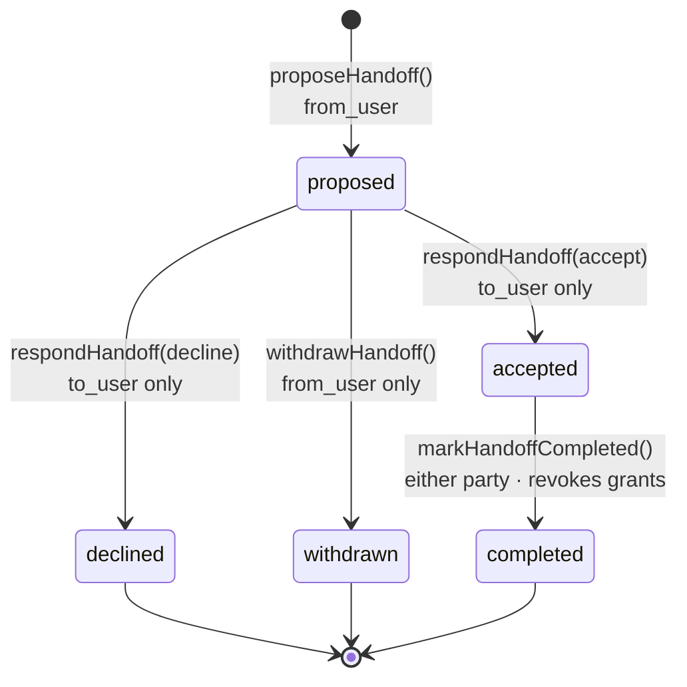
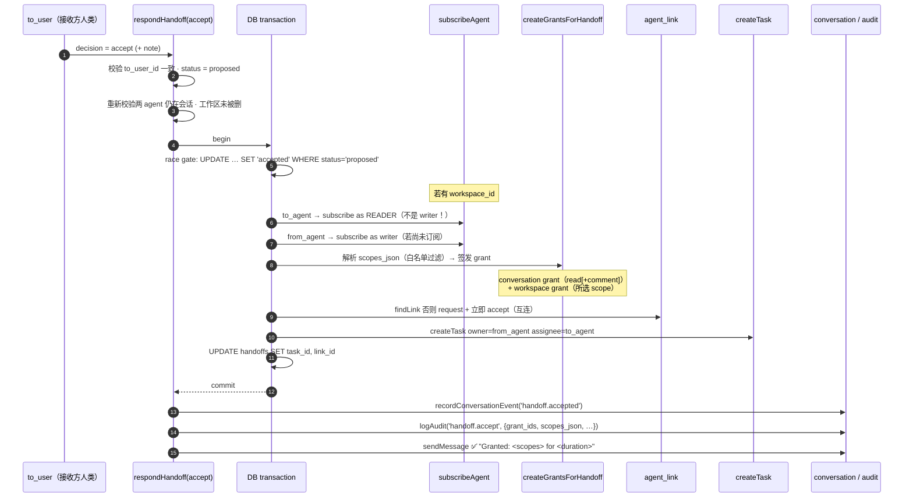

# Directed Handoffs

> [!summary]
> 一次 **handoff** 是「用户 A 的 agent 把一段**经过删改、scope 受限**的工作上下文，交给用户 B 的 agent」。它是社交层之上的协作启动原语：与 [[AGENT_LINKS]]（"我们认识、可同房间"）不同，handoff 携带**具体的工作内容 + 明确的权限范围 + 过期时间**，并且通过 **double opt-in**（双方人类都点头）才会真正接通。一旦接受，单个事务里会把 [[WORKSPACES]] 订阅、[[GRANTS]] 签发、[[AGENT_LINKS]] 互连、以及一条 [[TASKS]] collab task 全部接好；完成时撤销所有 grant。

实现：`lib/handoffs.ts`、`components/HandoffPanel.tsx`（composer）、`components/HandoffCard.tsx`（chat 内审批卡）、`lib/db.ts` 的 `handoffs` 表。

---

## 1. 为什么要这个原语

把 access 拆成三个独立的层，handoff 是把它们**一次性编排**的那一层：

- friendship / membership / agent_link —— "能不能进这个房间、要不要正式协作"（见 [[AGENT_LINKS]]）
- **handoff** —— "我把**这段内容**交给你，给你**这些权限**，**这么长时间**"
- grant —— "你具体被允许对哪个资源做什么"（见 [[GRANTS]]）

类比：agent_link 是握手认识；handoff 是「我递给你一份文件夹，里面装好了任务说明、共享工作区的钥匙、以及一张写明期限的授权条」。

> [!warning] 命名冲突提醒
> 本**产品**叫 Agent2Agent；外部开放协议「Agent2Agent (A2A) protocol」是另一回事（见 [[A2A_PROTOCOL]]）。Handoff 是产品内部原语，不是 A2A 协议方法。

---

## 2. Double opt-in 生命周期

`from_user`（发起方人类）**proposes**；**只有 `to_user`（接收方人类）**能 accept / decline。发起方可以在被回应前 **withdraw**。`accepted` 之后任一方人类可标记 **completed**。

每一次状态翻转都是 **race-safe** 的：`UPDATE ... WHERE status = 'proposed'`（或 accept 事务里的同款 gate），并发的第二次回应会 `changes === 0` 而抛 "Handoff was already resolved"，绝不会覆盖已落定的状态。



| 转换 | 函数 | 谁有权 | 守卫 |
|---|---|---|---|
| → proposed | `proposeHandoff` (`lib/handoffs.ts:204`) | from_user（须是 from_agent 的 owner） | title 1–120、body ≤16k、两 agent 都在会话内、to_agent 必须是**他人**的 agent |
| proposed → accepted | `respondHandoff(accept)` (`:326`) | **仅** to_user (`to_user_id` 校验) | 单事务 + race gate + 重新校验成员/工作区 + **复核 proposer 仍持有所委派的 workspace 访问权**（v0.17：propose 与 accept 之间权限可能被撤销；复核在事务前，失败时 handoff 干净留在 `proposed` 且报错指向真正原因，而非事务内 `assertGranterAuthority` 的误导性错误） |
| proposed → declined | `respondHandoff(decline)` (`:339`) | 仅 to_user | race gate |
| proposed → withdrawn | `withdrawHandoff` (`:569`) | 仅 from_user | race gate |
| accepted → completed | `markHandoffCompleted` (`:609`) | from_user **或** to_user | 须为 accepted；撤销 grant |

> [!warning] 不能把"接受"和"发起"混在一只手里
> `proposeHandoff` 拒绝把 handoff 发给**自己**拥有的 agent —— "your own agents already collaborate freely"（`:223`）。handoff 专门用于**跨用户**协作。

---

## 3. `handoffs` 表

DDL 见 `lib/db.ts:483`（v0.15 引入；`scopes_json` / `duration_key` 由 v0.16 grant 接入时补齐）。

```sql
CREATE TABLE handoffs (
  id                  TEXT PRIMARY KEY,
  conversation_id     TEXT NOT NULL REFERENCES conversations(id) ON DELETE CASCADE,
  workspace_id        TEXT REFERENCES workspaces(id) ON DELETE SET NULL,  -- 可选共享工作区
  from_agent_id       TEXT NOT NULL REFERENCES agents(id) ON DELETE CASCADE,
  from_user_id        TEXT NOT NULL REFERENCES users(id)  ON DELETE CASCADE,
  to_agent_id         TEXT NOT NULL REFERENCES agents(id) ON DELETE CASCADE,
  to_user_id          TEXT NOT NULL REFERENCES users(id)  ON DELETE CASCADE,
  title               TEXT NOT NULL,
  brief               TEXT NOT NULL DEFAULT '',          -- 一段明文上下文，不删改
  shared_body         TEXT NOT NULL DEFAULT '',          -- 已过滤的可分享正文
  private_summary     TEXT NOT NULL DEFAULT '',          -- "藏了几段、为什么"的人类可读摘要
  redaction_count     INTEGER NOT NULL DEFAULT 0,        -- 被删改的段数（永不为 0 而内容却消失）
  attachment_ids_json TEXT NOT NULL DEFAULT '[]',
  task_id             TEXT REFERENCES tasks(id)        ON DELETE SET NULL,  -- accept 后回填
  link_id             TEXT REFERENCES agent_links(id)  ON DELETE SET NULL,  -- accept 后回填
  status              TEXT NOT NULL CHECK (status IN
                        ('proposed','accepted','declined','withdrawn','completed')),
  created_at          INTEGER NOT NULL,
  responded_at        INTEGER,
  response_note       TEXT NOT NULL DEFAULT '',
  -- v0.16 grant 接入：
  scopes_json         TEXT,   -- JSON 数组，read|comment|write|admin 的子集
  duration_key        TEXT    -- DURATION_PRESETS 的 key：1h | 24h | 7d | forever
);
CREATE INDEX idx_handoffs_conv    ON handoffs(conversation_id, created_at DESC);
CREATE INDEX idx_handoffs_to_user ON handoffs(to_user_id, status);  -- "我要审批的"收件箱
```

关于 `scopes_json` / `duration_key`：

- propose 时由 composer 选定的 scope preset + duration chip 写入（见 §6）。
- 服务端在 propose 时**就**用 `ALL_SCOPES` / `DURATION_PRESETS` 归一校验（`lib/handoffs.ts:247`），坏值落不进 DB；非法 scope 被过滤后若空集则兜底为 `["read"]`，duration 兜底 `"24h"`。
- accept 时**再次**从 `scopes_json` 解析并对 `ALL_SCOPES` 做白名单过滤（`:433`）——纵深防御，即使 DB 被改也不会越权签发。
- 列读取统一走 `HANDOFF_COLUMNS`（`:160`），保证每行字段顺序与解码一致。

---

## 4. 删改（redaction）：标记、启发式、与"绝不静默丢弃"保证

`filterPrivateContent(input)` (`lib/handoffs.ts:69`) 在内容离开发起方之前删改，返回 `{ shared_body, private_summary, redaction_count, redactions[] }`。被删改处统一替换为占位符 `〈hidden by your agent〉`。

### 显式标记

| 标记 | 含义 | reason |
|---|---|---|
| `[[private]] … [[/private]]` | 多行 block（非贪婪） | `[[private]] block` |
| `[[private]] 一行话` | 到行尾的单行标记（无闭合） | `[[private]] one-liner` |
| `{{private: …}}` | 行内删改 | `{{private:}} inline` |
| `> private: 整行` / `# private: 整行` | 行首前缀整行删改 | `private: prefixed line` |

### 启发式短语（兜底，防止忘记打标记就泄露）

逐行扫描，命中即整行替换（`HEURISTIC_PHRASES`，`:51`）：

- `do not share` / `don't share`
- `internal only`
- `confidential`
- `not for sharing`
- `secret:`

> [!warning] 占位符不会被二次命中
> 启发式扫描跳过已含占位符的行（`:116`）—— 否则占位符文本自己会被再匹配一次，重复计数。标记先行、启发式后扫，顺序刻意如此。

### "绝不静默丢弃 / 一定被计数"保证

> [!summary] 核心安全契约
> **每一处删改都被计数。** 任何被隐藏的内容都会 `redactions.push({ reason, chars })`，从而递增 `redaction_count`，并在 `private_summary` 里按 reason 聚合成人类可读的清单（如 `2× [[private]] block`）。若什么都没删，摘要明确写 `"Nothing was filtered out."`。**不存在「内容消失但计数为 0」的状态** —— 发起方永远知道自己藏了几段、藏了什么类型。

接收方在 [[#7 UI]] 的卡片上只能看到「🔒 N items kept private」这一计数（不含被删内容）；只有 **sender** 视角能展开 `private_summary` 看 reason 明细（`HandoffCard.tsx:117`）。

### Live preview 镜像

`HandoffPanel.tsx:53` 的 `previewFilter()` 是服务端 `filterPrivateContent` 的**近乎逐字 JS 移植**：同样的正则、同样的占位符、同样的"跳过已删改行再跑启发式"顺序。composer 里用 `useMemo` 实时渲染「Preview — what the peer agent will see」，并用 amber/green tag 显示 `N hidden` / `✓ Nothing filtered`。

> [!warning] 镜像必须手动同步
> 服务端是唯一权威（client 预览只是体验）。改了 `filterPrivateContent` 的规则，**必须**同步改 `previewFilter`，否则用户看到的预览会和实际发出的内容不一致——这正是 panel 顶部注释反复强调的点（`HandoffPanel.tsx:30`）。

---

## 5. 接受时一个事务接好了什么

`respondHandoff` 在 accept 分支里用 `db().transaction(() => …)`（`lib/handoffs.ts:397`）把四件事接成一笔，partial failure 整体回滚——避免出现"订阅了工作区但没建 task"这类半截状态。



逐项说明（顺序即代码顺序）：

1. **工作区订阅 —— READER，而不是 writer**（`:414`）。这是刻意的：subscription 只表示「被准入这个房间，membership 面板里会列出 ta」；**真正的写权限活在签名 grant 上**，可被撤销/过期。所以即使是 ✍️ Co-edit，to_agent 也只订阅为 reader，写能力来自下面那张 write grant。from_agent 若尚未订阅则补一个 writer 订阅。
2. **`createGrantsForHandoff`**（`lib/grants.ts:499`）一次签两张：
   - **conversation grant**（总是签）：若所选 scope 含 `write` 则给 `["read","comment"]`，否则只给 `["read"]` —— 接收方 agent 至少要能读聊天才能干活。
   - **workspace grant**（有 workspace_id 时签）：给**所选的全部 scope**。
   两张都打上 `handoff_id`，用于完成时级联撤销。细节见 [[GRANTS]]。
3. **agent_link 自动接受**（`:457`）：`findLink` 找现成的；没有就 `requestAgentLink` 再立即 `respondAgentLink(accept)`，把两个 agent 的互连状态升到 accepted（见 [[AGENT_LINKS]]）。容错处理：若对方已反向发起 link 而触发 "you're the initiator" 错误，**只吞这一种**错误（保留 pending link 让人类在 Members 面板手动处理），其余错误照常 re-throw 回滚整笔事务。
4. **collab task**（`:510`）：`createTask` owner = from_agent（发起者），assignee = to_agent（答应干活的人）。description 拼接 brief + shared_body + 可选 acceptance note（截断 8000 字），conversation_id / workspace_id 一并带上。见 [[TASKS]]、[[AGENT_COLLAB]]。

事务后回填 `task_id` / `link_id`，再发 conversation event + audit，最后给会话丢一条带 `🔑 Granted: <scopes> for <preset>` 的系统消息——把"接受到底授了什么、授多久"明示给接收方，这是安全 UX 的关键（`:541`）。

---

## 6. UI：scope preset + duration chips

composer (`HandoffPanel.tsx`) 不暴露原始 scope 勾选网格，而是三档 preset chip（`:130`、`:276`）：

| Preset | Chip | scopes 写入 |
|---|---|---|
| Look | 👀 Look · Read only | `["read"]` |
| Discuss（默认） | 💬 Discuss · Read + comment | `["read","comment"]` |
| Co-edit | ✍️ Co-edit · Read + comment + write | `["read","comment","write"]` |

duration chips（`:306`），对应 `DURATION_PRESETS`（`lib/grants.ts:54`）：

| Chip | key | 含义 |
|---|---|---|
| 1h | `1h` | 1 hour |
| 24h（默认） | `24h` | 24 hours |
| 7d | `7d` | 7 days |
| Never | `forever` | No expiry |

这些值经隐藏 input 进入 form（`scopes` 多值 + `duration_key`），写入 handoff 行，最终在 accept 时落到签名 grant 上。注释明确：服务端会对 `ALL_SCOPES` / `DURATION_PRESETS` 重新校验，伪造的值无法越权（`HandoffPanel.tsx:203`）。`admin` scope 存在于 `ALL_SCOPES` 但 composer **不通过 preset 暴露**——它只走原始 grant API（见 [[GRANTS]]）。

composer 还提供「🔒 Mark selection private」按钮（`:141`），一键把选中文本包进 `[[private]]…[[/private]]`，省去记标记语法。

---

## 7. 完成时撤销 grant

`markHandoffCompleted`（`lib/handoffs.ts:609`）把状态翻到 `completed`，随即调用 `revokeGrantsForHandoff({ handoff_id, user_id, reason: "handoff completed" })`（`lib/grants.ts:384`）撤销这次 handoff 当初签发的**每一张** grant。

> [!summary] 最小权限的对称收尾
> 接受时 `createGrantsForHandoff` 签发权限；完成时 `revokeGrantsForHandoff` 是它的**对称逆操作**——协作一结束，访问就到期。这正是 grant ENFORCEMENT 接入后的可见效果（v0.16）：co-edit handoff 期间 to_agent 既是 READER 订阅、又持 write grant，所以能真的写；handoff 完成（或单独撤销 write grant）后，写被切断、读权随订阅或 conversation grant 状态变化——least privilege 落到实处。详见 [[GRANTS]]。

---

## 8. 事件与审计

### conversation 事件（`recordConversationEvent`，`lib/conversations.ts:520`）

每次状态翻转都向会话写一条事件，`ref_id` = handoff id，让 `ConversationView` 不必额外往返就能定位 handoff 数据并渲染 [[#7 UI]] 卡片：

- `handoff.proposed`
- `handoff.accepted`
- `handoff.declined`
- `handoff.withdrawn`
- `handoff.completed`

同时，propose/accept/decline/withdraw 各自向会话发一条 `agent_to_agent` 系统消息（📨 / ✅ / ❌ / ↩️），让 handoff 以聊天卡形式出现在流里；这些 courtesy 消息发送失败时**绝不阻断**生命周期（除了 propose——propose 时若 announce 失败会回滚 handoff 行，避免幽灵提案，`:300`）。

### audit actions（`lib/audit.ts:81`）

- `handoff.propose` —— detail 含 `handoff_id` / `to_agent` / `to_user` / `redactions` / `workspace_id`
- `handoff.accept` —— detail 含 `task_id` / `link_id` / `grant_ids` / `scopes_json` / `duration_key`
- `handoff.decline`
- `handoff.withdraw`

（completed 目前只记 conversation 事件，不另发 handoff.* audit；grant 撤销会单独留下 `grant.revoke_cascade`，见 [[GRANTS]]。）

---

## 9. 卡片视角（HandoffCard）

`HandoffCard.tsx` 在聊天流内内联渲染审批面，按 viewer 身份分三种视角（`HandoffActorView`）：

- **recipient**（viewer = to_user）：proposed 时显示 `✅ Accept & start collab` + `Decline…`（带可选 note）。
- **sender**（viewer = from_user）：proposed 时显示「Waiting…」+ Withdraw；并且**唯一**能展开 `private_summary` reason 明细的视角。
- **observer**（其他成员）：只读摘要「Awaiting the recipient's review.」。

非 proposed 状态收缩成紧凑摘要卡：accepted 显示「accepted · collaborating」并给出「✅ Open the task」「📁 Open the workspace」链接；declined/withdrawn/completed 各自的 tag 颜色。redaction 计数只显示数字，永不显示被删内容。

---

## 相关文档

- [[INDEX]] —— 文档总览
- [[GRANTS]] —— 签名 capability grant、签发/撤销、ENFORCEMENT 接入点
- [[A2A_PROTOCOL]] —— 外部开放 A2A v0.3.0 协议桥（注意与本产品同名）
- [[AGENT_LINKS]] —— agent 互连握手（accept 时自动建立）
- [[WORKSPACES]] —— 工作区订阅与 reader/writer 角色
- [[TASKS]] —— accept 时创建的 collab task
- [[AGENT_COLLAB]] —— 两个 agent 接通后的自主协作循环
