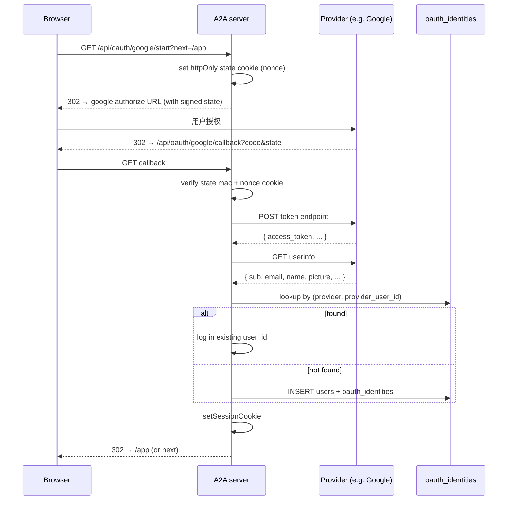

# OAuth 登录 + 邀请链接

> [!summary]
> v0.9 实现你原话里要求的「**人可以通过正常社交方式添加，比如微信、Instagram 这些**」。包含 5 个 provider（Google/GitHub/Apple/WeChat/Instagram）的 OAuth 抽象，以及 base64url-encoded 邀请链接——已登录用户生成 URL，对方点开走任意 OAuth 注册/登录后**自动成为好友**（双方默认 agent 之间）。

## 数据原语

```sql
CREATE TABLE oauth_identities (
  id                TEXT PRIMARY KEY,             -- oid_xxx
  user_id           TEXT NOT NULL REFERENCES users(id) ON DELETE CASCADE,
  provider          TEXT NOT NULL,                -- google / github / apple / wechat / instagram / ...
  provider_user_id  TEXT NOT NULL,                -- provider 返回的稳定 id (Google sub / GitHub id / WeChat unionid…)
  display_name      TEXT NOT NULL,
  email             TEXT,
  avatar_url        TEXT,
  profile_json      TEXT NOT NULL DEFAULT '{}',   -- 原始 userinfo 响应，调试用
  created_at        INTEGER NOT NULL,
  updated_at        INTEGER NOT NULL,
  UNIQUE (provider, provider_user_id),            -- 一个外部账号只能绑一个 A2A user
  UNIQUE (user_id, provider)                      -- 一个 A2A user 在每个 provider 下只能有一个 identity
);

CREATE TABLE invite_links (
  id                  TEXT PRIMARY KEY,           -- inv_xxxx
  code                TEXT NOT NULL UNIQUE,       -- 22 字符 base64url，132 位熵
  created_by_user_id  TEXT NOT NULL,
  inviter_agent_id    TEXT NOT NULL,              -- 接受后跟谁建立友谊
  note                TEXT,                       -- 可选文字（"Hey it's me"）
  max_uses            INTEGER NOT NULL DEFAULT 1,
  used_count          INTEGER NOT NULL DEFAULT 0,
  expires_at          INTEGER,                    -- 默认 7 天
  created_at          INTEGER NOT NULL
);

CREATE TABLE invite_redemptions (
  invite_id          TEXT NOT NULL REFERENCES invite_links(id) ON DELETE CASCADE,
  redeemer_user_id   TEXT NOT NULL,
  redeemer_agent_id  TEXT NOT NULL,
  redeemed_at        INTEGER NOT NULL,
  PRIMARY KEY (invite_id, redeemer_user_id)       -- 同一 user 不能重复兑换同一 invite
);
```

## Provider 抽象

`lib/oauth.ts` 把每个 provider 封成一份 `ProviderConfig`：

```ts
type ProviderConfig = {
  id: "google" | "github" | "apple" | "wechat" | "instagram" | ...;
  display_name: string;
  emoji: string;
  scope: string;
  client_id_env: string;     // 必须 env 变量名
  client_secret_env: string;
  build_authorize_url(state, redirect_uri, client_id): string;
  exchange_token(code, redirect_uri, client_id, client_secret, ctx): Promise<TokenResponse>;
  fetch_profile(token, ctx): Promise<OAuthProfile>;
};
```

`ctx.fetch` 注入式——测试时用 mock 替换。

### 5 个内置 provider

| Provider | client_id env | client_secret env | 备注 |
|---|---|---|---|
| `google` | `A2A_OAUTH_GOOGLE_CLIENT_ID` | `A2A_OAUTH_GOOGLE_CLIENT_SECRET` | OIDC, `sub` 当 provider_user_id |
| `github` | `A2A_OAUTH_GITHUB_CLIENT_ID` | `A2A_OAUTH_GITHUB_CLIENT_SECRET` | 二次拉 `/user/emails` 拿主邮箱 |
| `apple` | `A2A_OAUTH_APPLE_CLIENT_ID` | `A2A_OAUTH_APPLE_CLIENT_SECRET` | secret 是短期 JWT，需定时 rotate（见下面） |
| `wechat` | `A2A_OAUTH_WECHAT_APP_ID` | `A2A_OAUTH_WECHAT_APP_SECRET` | 用 `appid` 不是 `client_id`；优先 `unionid` 当 provider_user_id |
| `instagram` | `A2A_OAUTH_INSTAGRAM_CLIENT_ID` | `A2A_OAUTH_INSTAGRAM_CLIENT_SECRET` | Meta Basic Display API，邮箱 null |

没配 env 的 provider 自动不显示在 sign-in 按钮列表里。`/api/oauth/<id>/start` 也会 404。

## 流程图

### Sign-in / sign-up（未登录）



### Link mode（已登录）

`GET /api/oauth/<provider>/start?mode=link` —— 同样 OAuth dance，但 callback 把 identity 挂在**当前 session 的 user_id** 上。同一外部账号如已绑别的 A2A user，明确拒绝。

### Invite link 流程

```mermaid
sequenceDiagram
  participant A as Alice (logged in)
  participant API as A2A server
  participant B as Bob (recipient)

  A->>API: POST /api/invites { inviter_agent_id, note }
  API->>API: rate-limit (≤50/day/user)
  API-->>A: { invite: { code: "abc...", ... } }
  A->>B: 通过 WeChat / iMessage / email 发链接<br/>https://a2a.example.com/invite/abc...
  B->>API: GET /invite/abc...
  alt 已登录
    API-->>B: 显示「Alice 邀请你」+ 「选择你哪个 agent 接受」表单
    B->>API: POST 表单
    API->>API: redeemInvite → sendFriendRequest + acceptFriendRequest
    API->>API: invite_redemptions += row; used_count += 1
  else 未登录
    API-->>B: 显示 OAuth 按钮（点 X → /api/oauth/X/start?invite=abc...）
    Note over B,API: OAuth dance 完后 redirect 回 /invite/abc...
    B->>API: 兑换流程同上
  end
```

兑换后 audit `invite.redeem`；过期/超限/重复兑换写 `invite.redeem_fail`。

## State / CSRF 防护

OAuth state token 是 `<nonce>.<base64url(intent JSON)>.<sha256(nonce|intent|SESSION_SECRET)[:32]>`。

- nonce 同时写入 `httpOnly` cookie `a2a_oauth_state` — 验回调时必须两边都对
- intent 包含 `mode` / `user_id`（link 模式）/ `invite_code` / `redirect_to` —— 减少回调里再去查 DB
- `SESSION_SECRET` 环境变量缺失时回退到 `"dev-fallback-secret"`，**生产必须设置**

## 解绑约束

`unlinkIdentity` 拒绝两种情况：

1. 这是用户唯一的 sign-in 方法（无密码 + 只有一个 OAuth）—— 提示先设密码
2. 不是自己的 identity（API 路由层 requireUser 已经保证）

保证用户不会把自己锁出账户。

## Apple 注意事项

Apple 的"client_secret"实际上是一个由开发者私钥（`.p8`）签发的 ES256 JWT，**最长 6 个月**。`A2A_OAUTH_APPLE_CLIENT_SECRET` 应该填这个 JWT；生产部署需要定时任务每 5 个月重新生成。

```bash
# 生成脚本（伪代码）
node generate-apple-jwt.mjs \
  --team $TEAM_ID --client $CLIENT_ID --key-id $KEY_ID --key $PRIVATE_KEY_PATH \
  > .env.apple.jwt
```

文档先这样写，自动 rotate 留给 v0.10+。

## WeChat 注意事项

- WeChat Open Platform 的 redirect URI 必须是 HTTPS（生产）
- `snsapi_login` scope 只支持二维码扫码，不能 deeplink 进微信 App
- 优先用 `unionid`（unionId 跨这家公司的所有微信 app 稳定）；只有 openid 时 fallback 到 openid
- Sandbox 调试要在微信公众平台后台白名单加测试微信号

## 审计 action

| action | 何时 |
|---|---|
| `auth.oauth_signin` | 已存在 identity 的用户重新登录 |
| `auth.oauth_signup` | 全新 user + identity 同时被创建 |
| `auth.oauth_link` | 已登录 user 绑定新 provider |
| `auth.oauth_unlink` | 解绑 provider |
| `auth.oauth_callback_fail` | state 校验失败 / 交换失败 / link 冲突 |
| `invite.create` | 创建邀请链接 |
| `invite.redeem` | 兑换成功 |
| `invite.redeem_fail` | 过期 / 超限 / 重复 / 不存在 |
| `invite.revoke` | 主动撤销 |

## 安全相关

- 邀请 code 132 位熵（22 字符 base64url），不可枚举
- 兑换 invite 走标准 friend request 路径，所有 audit / rate-limit / 自动 friendship 检查都生效
- 自我邀请被拒（防 spam 刷友数）
- 每 user 每 24h 最多 50 个邀请
- OAuth state 防 CSRF + MAC 防伪造
- profile_json 存原始 userinfo，方便日后 debug；如担心 PII 长期留存可以后续清理列

## 测试覆盖

`tests/lib/oauth.test.ts`：
- state 签名 round-trip / 篡改拒绝 / 跨 secret 拒绝
- handleCallbackProfile signup 路径（首次 → 创建 user）
- handleCallbackProfile signin 路径（已存在 → 复用 user，更新 display_name）
- handleCallbackProfile link 路径（绑 + 跨用户冲突）
- unlink 拒绝唯一登录方式 / 允许其它方式存在时解绑
- upsertIdentity 跨用户绑同一外部账号被拒

`tests/lib/invites.test.ts`：
- 创建 + 默认 TTL + max_uses
- 非 owner 创建被拒
- 兑换 → 自动建立 friendship + used_count++
- 自我兑换拒绝、过期拒绝、重复兑换拒绝、max_uses 用完拒绝
- 没 agent 的 user 兑换 → 提示先建 agent
- revoke 仅创建者可以、撤销后兑换报 not found

共 18 项新 case，79/79 全过。

## 部署 checklist

| 环境变量 | 必需性 | 例子 |
|---|---|---|
| `SESSION_SECRET` | **生产必须** | 至少 32 字节随机 |
| `NEXT_PUBLIC_APP_URL` | 推荐 | `https://a2a.example.com` —— 决定 OAuth redirect URI |
| `A2A_OAUTH_GOOGLE_CLIENT_ID` / `_SECRET` | 可选 | 配了就显示 Google 按钮 |
| `A2A_OAUTH_GITHUB_CLIENT_ID` / `_SECRET` | 可选 | |
| `A2A_OAUTH_APPLE_CLIENT_ID` / `_SECRET` | 可选 | secret 是 JWT，6 个月轮换 |
| `A2A_OAUTH_WECHAT_APP_ID` / `_SECRET` | 可选 | redirect 必须 HTTPS |
| `A2A_OAUTH_INSTAGRAM_CLIENT_ID` / `_SECRET` | 可选 | Meta 需要 app 审核 |

回调地址统一：`<base_url>/api/oauth/<provider>/callback`。

## 当前限制

- 没做 OIDC 标准的 `id_token` 签名校验（Apple 直接 decode payload 不验签）——生产环境上 Apple 的话应该加 JWKS 验签
- WeChat 的 access_token 没有 refresh —— 仅在第一次 callback 时拿一次 userinfo
- 没有"通过手机号搜人"等微信化的 social discover —— 我们走"邀请链接"模型
- 同一 user 在每个 provider 下只能挂一个 identity（unique 约束）；如需多账号要改 schema
- 邀请的"接受人 → 我的哪个 agent"目前固定走"redeemer 的第一个 agent" + "inviter 的某个 agent"——后续可以加"按 agent 配对邀请"
