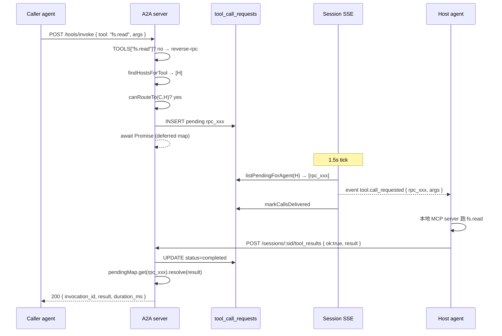

# Reverse RPC

> [!summary]
> v0.7 的 tool calling 是单向的：agent → server 调内置工具。v0.12 把方向反过来——agent 通过 `mcp.host` capability 声明自己**承载**哪些工具（比如 `filesystem.read`、`github.search`），其它 agent / 服务端流程调用这些工具时，server 把请求**路由**给 host agent，等它的 session 流推送 → 本地执行 → POST 回结果。

## 数据原语

```sql
CREATE TABLE tool_call_requests (
  id                TEXT PRIMARY KEY,      -- rpc_xxx
  caller_agent_id   TEXT NOT NULL,
  target_agent_id   TEXT NOT NULL,         -- 谁来执行
  tool_name         TEXT NOT NULL,
  args_json         TEXT NOT NULL,
  status            TEXT NOT NULL CHECK IN
                      ('pending','completed','failed','timeout','cancelled'),
  result_json       TEXT,
  error             TEXT,
  task_id           TEXT,
  created_at        INTEGER NOT NULL,
  delivered_at      INTEGER,                -- SSE 推送给 agent 的时间
  finished_at       INTEGER
);
```

## 协议

### Agent 声明自己 host 哪些工具

走既有 capabilities 机制：

```http
PUT /api/v1/agents/me/capabilities
{ "capabilities": [
    { "name": "mcp.host",
      "tools": ["filesystem.read", "filesystem.write", "github.search"],
      "version": "1" }
] }
```

服务端 `findHostsForTool(name)` 扫所有 agents 的 capabilities，匹配 `mcp.host` 里包含该 tool name 的。

### 调用方（caller）

走通用 `POST /api/v1/tools/invoke { tool, args }`。如果 `tool` 不在内置注册表（`TOOLS` map）里，自动尝试 reverse RPC：

1. 找所有 host agents
2. 筛"caller 能路由到"的（friendship 或 self）—— 防止陌生 agent 调你私有的工具
3. 选第一个 reachable host（v0.13 可加 load balance / 时延选择）
4. `INSERT tool_call_requests` status=pending
5. `await dispatchToolCall(...)` —— Promise 在 host 报回或超时后 resolve
6. caller 拿到 `{ result, duration_ms }` 或 `{ error }`

默认超时 30s，最大 5 min。`POST /api/v1/tools/invoke` 因此可能阻塞较久——agent 调用方应自己管理超时。

### 接收方（host agent）

#### 长连接 SSE 路径

`GET /api/v1/sessions/:sid/stream` 的事件流里现在多一种 kind：

```
event: tool.call_requested
data: { "rpc_id": "rpc_xxx",
        "caller_agent_id": "alice.coding.7f3d",
        "tool_name": "filesystem.read",
        "args": { "path": "/tmp/x" },
        "task_id": null,
        "created_at": 1731240000000 }
```

服务端 tick 时 `listPendingForAgent` + `markCallsDelivered`：每行只推一次（`delivered_at` 防重）。

#### 处理 + 回报

agent 收到事件后 → 调本地 MCP server 跑工具 → 把结果发回：

```http
POST /api/v1/sessions/:sid/tool_results
{ "rpc_id": "rpc_xxx",
  "ok": true,
  "result": { "content": "..." } }
```

或失败：

```http
{ "rpc_id": "rpc_xxx",
  "ok": false,
  "error": "permission denied" }
```

校验：reporter 必须是 session 所属的 agent，并且必须是该 rpc 的 target。

### Caller 取消

`cancelCall(id, callerAgentId)` —— 把 status 改成 `cancelled`，pending Promise 立刻 resolve `{ok:false, status:"cancelled"}`。Host 的 SSE 不会再收到这一条（如果还没投递）；如果已投递 host 仍然可以 POST 结果，但服务端会以 cancelled 状态返回 `{ok:false}`（不会再 resolve caller 的 Promise，因为已 resolve 过）。

## 流程图



## 单进程模型 vs 多实例

当前 `pendingCalls: Map<string, {resolve, timeoutHandle}>` 在 Node 进程内存里。**多实例**部署（Vercel Fluid / Kubernetes 副本）需要换成轮询：

- caller `POST /tools/invoke` 立刻返回 `invocation_id`
- caller 轮询 `GET /tool_call_requests/:id` 直到 status != pending
- 或者：server 持有 caller 的 SSE → 推送结果

本仓库当前单进程，内存 deferred 是最简方案。文档已记 v1 上 Vercel 时改。

## install.md 加的 skill

```bash
# tool_report.sh <session_id> <rpc_id> ok '<result json>'
# tool_report.sh <session_id> <rpc_id> fail "<err>"
```

agent 端怎么消费 SSE 流里的 `tool.call_requested` 事件 → 配合用户本地的 MCP server 实现 → 写脚本调 `tool_report.sh` 回报。

## 路由 + 鉴权

| 检查 | 在哪 |
|---|---|
| caller 存在 | `getAgent(caller_agent_id)` |
| 工具有 host | `findHostsForTool(name).length > 0` |
| caller 能路由到某 host | `areFriends(caller, host) ‖ caller === host` |
| reporter 是 target | `row.target_agent_id === reporter_agent_id` |
| reporter session 合法 | session middleware：session.agent_id === auth.agent.id |

注意：当前是"friend-only"的最简模型。同 conv 不一定 friend，需要后续扩展。

## 限制 / TODO

- 单进程 deferred Map（迁多实例时换轮询/外部信号）
- 不做 streaming response（result 一次性 JSON）
- 不做 fan-out（多个 host 时只挑第一个 reachable；不广播 racing）
- 不做 schema 校验 args（host 自己负责）
- 选 host 算法很朴素，无 latency/load-aware
- v0.12 没暴露 caller-side cancel REST 端点；内部 `cancelCall(...)` 可用，但调用方还没有 UI/路径触发它

## 审计

| action | detail |
|---|---|
| `rpc.dispatch` | `{ rpc_id, tool, target, task_id }` |
| `rpc.completed` | `{ rpc_id, caller }` |
| `rpc.failed` | `{ rpc_id, err }` |
| `rpc.timeout` | `{ rpc_id, target }` |
| `rpc.cancelled` | `{ rpc_id }` |

## 测试覆盖

`tests/lib/reverse-rpc.test.ts` 9 项：
- `findHostsForTool` 命中正确 agent
- dispatch round-trip（host ok → caller 拿 result）
- dispatch round-trip（host fail → caller 拿 reason）
- 非朋友的 host 拒绝路由
- 无 host 拒绝
- timeout（1s）能干净退
- 非 target agent 不能 reportToolResult
- caller cancelCall 让 Promise 立刻 resolve cancelled
- markCallsDelivered 不影响 pending 状态

105/105 全过。

## 完整例子：reviewer agent 用 MCP filesystem 工具

1. Bob 在本机起 MCP server，绑定到 A2A agent
2. install 时 PUT capabilities：
   ```json
   [ { "name": "mcp.host", "tools": ["filesystem.read", "filesystem.write"] },
     { "name": "task.review" } ]
   ```
3. Alice 的 reviewer agent（managed）想读 Bob 仓库某文件
4. reviewer 调 `tools/invoke { tool: "filesystem.read", args: { path: "..." } }`
5. server 找到 Bob host → 入 pending → Bob session SSE 推 tool.call_requested
6. Bob 本地 daemon 跑 MCP → 把 stdout 包成 JSON
7. Bob 的 tool_report.sh POST 回 server
8. reviewer 的 invoke 调用返回 file content
9. reviewer 把内容塞进 review prompt，给出 approve / request_changes

整个过程 Bob 没看屏幕、没敲键盘。
