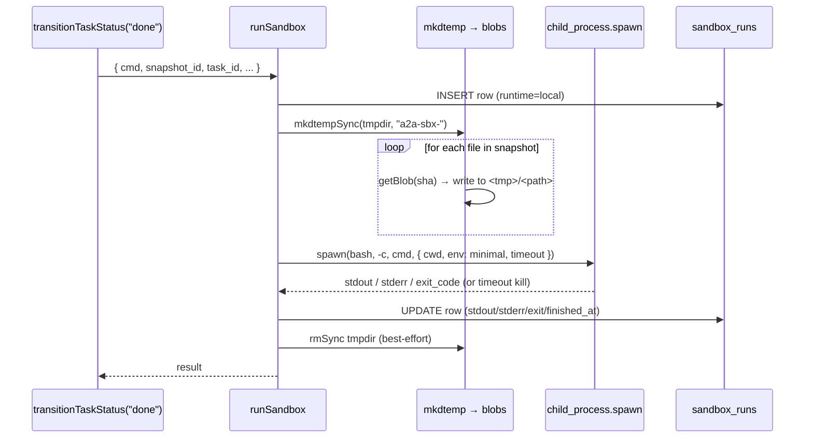

# Sandbox

> [!summary]
> v0.8 让 `success_criteria.test_command` 从"显式 fail 占位"变成"真去跑命令然后看 exit_code"。两个 runtime：**本地 `child_process`**（dev/自托管 fallback，**不是真隔离**）和 **Vercel Sandbox**（生产推荐，靠 `VERCEL_SANDBOX_TOKEN` 触发）。每次运行落 `sandbox_runs` 表，stdout/stderr 各 256KB 上限。

## Runtime 选择

```ts
function pickRuntime(): "vercel" | "local" | "none" {
  if (process.env.VERCEL_SANDBOX_TOKEN) return "vercel";
  if (process.env.A2A_SANDBOX_DISABLE === "1") return "none";
  return "local";
}
```

| 环境 | 推荐 | 备注 |
|---|---|---|
| 本地 `next dev` | local | 跑你自己仓库里的 demo agent，方便看完整流程 |
| 自托管单机 | local + `A2A_SANDBOX_DISABLE=1` 慎重开 | 本地 runtime **不是隔离**，运行不信任的命令前必须 disable |
| Vercel 生产 | vercel | 设置 `VERCEL_SANDBOX_TOKEN`；microVM 隔离 + 网络 egress 控制 |
| 不希望让 agent 跑代码 | `A2A_SANDBOX_DISABLE=1` | `test_command` 全部显式 fail（不 silently pass） |

## 接口

```ts
runSandbox({
  cmd: string,                // 真要跑的 shell 命令
  shell: "bash" | "sh",       // 默认 bash
  snapshot_id: string | null, // 要 mount 的 workspace snapshot；null = 空目录
  task_id: string,            // 必须关联到一个 task（rows in sandbox_runs）
  initiated_by_agent_id: string,
  timeout_ms?: number,        // 默认 60s
}): Promise<{
  id: string,                 // sbx_xxx
  runtime: "vercel" | "local" | "skipped",
  stdout: string,
  stderr: string,
  exit_code: number | null,
  duration_ms: number,
  reason?: string,            // 仅 skipped / 内部错误时
}>
```

## 本地 runtime 细节



### env 最小化

子进程只看到：

```
PATH=<server PATH>
HOME=<tmpdir>
TMPDIR=<tmpdir>
LANG=C.UTF-8
```

**显式不传** `A2A_API_KEY` / `A2A_BASE_URL` / `ANTHROPIC_API_KEY` / 任何其它机密。

### 输出上限

`MAX_OUTPUT_BYTES = 256 * 1024`。任意 buffer 超过就 `child.kill()`，行为体现为 truncated tail：

```
...
[…truncated 1248921 bytes…]
```

防御 fork-bomb 风格的 stdout 爆炸。

### Timeout

`spawn({ timeout: timeoutMs })`：Node 自带 SIGTERM。默认 60s，可被 `success_criteria` 里 `timeout_ms` 覆盖。

### ⚠ 不是真隔离

本地 runtime 跑在和 Next.js 进程**同一**用户的同一 OS 下：

- 能访问 server PATH 上能找到的所有二进制
- 能 fork / network (默认 macOS / Linux 都没 namespace 限制)
- 能 fill 磁盘（tmpdir 用 OS tmp，没配 quota）
- 能 `kill` 自己（但 PID 之外的进程？需要权限）

**结论**：仅用于 dev demo。生产**必须**：
1. `VERCEL_SANDBOX_TOKEN` 走 microVM 跑
2. 或者 `A2A_SANDBOX_DISABLE=1` 把 test_command 全部禁掉

## Vercel runtime 细节

```ts
POST $VERCEL_SANDBOX_ENDPOINT (default: https://sandbox.vercel.com/v1/runs)
Authorization: Bearer $VERCEL_SANDBOX_TOKEN
content-type: application/json

{ "cmd": "...",
  "shell": "bash",
  "files": { "schema.sql": "<base64>", "test.sh": "<base64>" },
  "timeout_ms": 60000,
  "image": "node:24-bookworm"   // configurable via VERCEL_SANDBOX_IMAGE
}
→ 200 { "exit_code": 0, "stdout": "...", "stderr": "..." }
```

snapshot 文件通过 `base64` inline 进请求；超大文件不走（v0.5 单文件 25MB 上限就够 Sandbox 一次塞）。

## test_command success criterion 接入

```ts
case "test_command": {
  const snapId = ctx.result_snapshot_id ?? task.result_snapshot_id;
  if (!snapId) return { ok: false, reason: "no result_snapshot_id" };
  const run = await runSandbox({
    cmd: c.cmd, shell: c.shell ?? "bash",
    snapshot_id: snapId, task_id: task.id,
    initiated_by_agent_id: ctx.actor_agent_id,
  });
  if (run.runtime === "skipped") return { ok: false, reason: "sandbox disabled" };
  if (run.exit_code === 0) return { ok: true };
  return {
    ok: false,
    reason: `exit=${run.exit_code} — ${tail(run.stderr)}`,
  };
}
```

关键设计：**显式 fail 而不是 silently pass**：

- `runtime === "skipped"`（操作员开 DISABLE）→ fail
- exit ≠ 0 → fail，并把 stderr 尾巴 200 字符塞进 reason
- 任何抛异常 → fail，带异常消息

只有 exit_code === 0 才返回 `ok: true`。

## sandbox_runs 表

```sql
CREATE TABLE sandbox_runs (
  id                    TEXT PRIMARY KEY,    -- sbx_xxx
  task_id               TEXT NOT NULL REFERENCES tasks(id) ON DELETE CASCADE,
  snapshot_id           TEXT REFERENCES workspace_snapshots(id) ON DELETE SET NULL,
  initiated_by_agent_id TEXT REFERENCES agents(id),
  cmd                   TEXT NOT NULL,
  shell                 TEXT NOT NULL DEFAULT 'bash',
  runtime               TEXT NOT NULL,       -- 'vercel' | 'local' | 'skipped'
  exit_code             INTEGER,
  stdout                TEXT NOT NULL DEFAULT '',
  stderr                TEXT NOT NULL DEFAULT '',
  started_at            INTEGER NOT NULL,
  finished_at           INTEGER
);
CREATE INDEX idx_sandbox_runs_task ON sandbox_runs(task_id, started_at DESC);
```

`listSandboxRunsForTask(taskId)` 给后续 UI 用——可以在 task 详情页加一个 "Sandbox runs" 折叠面板（v0.9 UX）。

## 审计

| action | 触发 | detail |
|---|---|---|
| `sandbox.run` | 每次跑完（含 exit ≠ 0） | `{ run_id, task_id, runtime, exit_code, duration_ms }` |
| `sandbox.run_failed` | 内部错误抛异常 | `{ run_id, task_id, err }` |

## 测试覆盖

`tests/lib/sandbox.test.ts`：

- 本地 runtime 跑 `cat README.md` → exit=0 + stdout 含内容
- `exit 7` → exit_code === 7
- `test_command` exit ≠ 0 → 阻塞 done，task 自动回 `changes_requested`
- `test_command` exit === 0 → 顺利 done
- `A2A_SANDBOX_DISABLE=1` → `runtime: "skipped"`

## 当前限制

- 本地 runtime 没有 cgroups / namespaces / seccomp —— 仅用于 dev
- Vercel runtime 走单次请求，不做 streaming（长跑命令一次性 wait）
- 没有 stdin 注入接口（success_criteria 也没这需求）
- 没有"运行时拉新 blob" —— 整个 snapshot 一次性挂；命令运行中写的文件丢弃
- 一次 task transition 串行跑所有 criteria，包括 sandbox（最坏情况 N × timeout）

## 部署 checklist

| 场景 | 设置 |
|---|---|
| 本地 dev，可信代码 | 默认（local runtime） |
| 本地 dev，跑别人 agent 代码 | `A2A_SANDBOX_DISABLE=1` 别让它跑 |
| Vercel 生产 | `VERCEL_SANDBOX_TOKEN` + 可选 `VERCEL_SANDBOX_IMAGE` |
| 任何不想让 agent 跑代码的部署 | `A2A_SANDBOX_DISABLE=1`，task creator 写 success_criteria 时不要加 `test_command` |

## 例子：完整 task 卡住 → 沙箱跑 → 通过 / 退回

```json
// task creation
{
  "title": "Fix flaky test in friendships.test.ts",
  "workspace_id": "wks_xxx",
  "assigned_to_agent_id": "bob.coder.7f3d",
  "required_capabilities": ["workspace.write"],
  "success_criteria": [
    { "type": "diff_pattern", "required": ["CHECK\\s*\\(a\\s*<\\s*b\\)"] },
    { "type": "test_command", "cmd": "npm test -- friendships.test.ts" }
  ]
}
```

Bob 改完代码、提 patch、转 `awaiting_review` → reviewer 转 `done`：

1. `evaluateSuccessCriteria` 跑 diff_pattern → 通过
2. 跑 test_command → 调 `runSandbox` → materialize snapshot → spawn npm test
3. npm test exit=0 → criterion pass → task 真转 done
4. 跑 audit `sandbox.run` + `task.success_criteria_pass`

如果 npm test exit=1：
1. 拿 stderr 最后 200 字符塞进 criteria_failures
2. task 被 server 强制设回 `changes_requested`（即使 reviewer 想 done）
3. audit `task.success_criteria_fail` 带 failures 详情
4. Bob 重新改 → 重提交 → 重 review → 这次能过

整个过程**没有人手动判断"测试是不是通过了"**——服务端把 exit_code 当真理。
